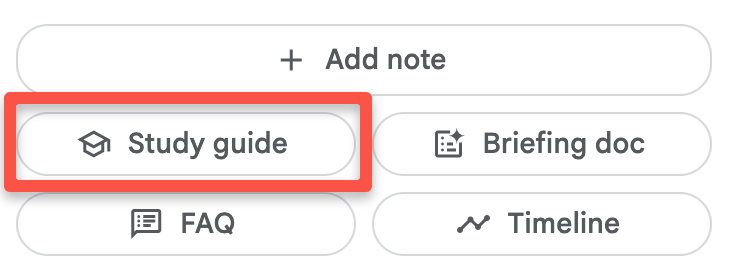
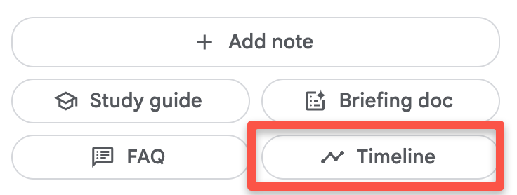
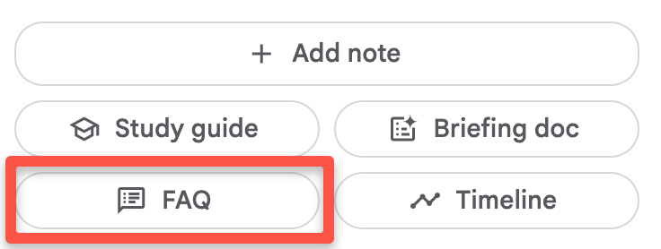

# Getting Started with NotebookLM’s _Notebook Guide_

> “Upload PDFs, websites, YouTube videos, audio files, Google Docs, or Google Slides, and NotebookLM will summarize them and make interesting connections between topics. With your sources in place, NotebookLM becomes a personalized AI expert grounded in the information that matters most to you and provides clear citations to exact quotes from your sources. NotebookLM does not use your personal data — including uploads, queries, and responses — to train its models.” ([NotebookLM](https://notebooklm.google.com/){:target="_blank"}, 2025)

> **Accuracy & Safety:** NotebookLM reduces errors by grounding on your sources, but it can still make mistakes. Always verify factual claims, especially outside your expertise.

If you have questions or get stuck during the exercise, please ask the instructor.

---

## Log in to NotebookLM
1. Go to the **[NotebookLM website](https://notebooklm.google.com/){:target="_blank"}**.
2. Click **Try NotebookLM** and sign in with a Google/Gmail account.  
   > If you don’t have an account, click **Create account** and follow the prompts. Ask your instructor if you run into issues.

 

---

## Create a Notebook & Add Documents
You’ll start by creating a notebook and adding seed documents so NotebookLM has sources to ground on.

1. **Download the three PDFs** for this activity (note your download location — typically “Downloads” or “Desktop”):
   - [Document 1](images/badge-article.pdf){:target="_blank"}
   - [Document 2](images/badge-article-2.pdf){:target="_blank"}
   - [Document 3](images/badge-article-3.pdf){:target="_blank"}
2. Click the blue **Create** button to make a new notebook.  
    
3. **Upload** the three PDFs using the **Choose file** control in the center of the page.  
    

Good job — you’re ready to explore the **Notebook Guide**.

---

## Explore the Notebook Guide

The Notebook Guide auto-generates structured helpers from your sources: **Audio Overview**, **Reports**, **Study Guide**, **Timeline**, and **FAQ**. Use these to get a “lay of the land” before deep-diving in Studio.

> **Note on citations:** NotebookLM’s **chat responses** include inline citations. Some **Notebook Guide** outputs (e.g., Reports) summarize without inline citations, so plan to spot-check facts against source passages.

### 1) Source Summaries
- Click each source in the left panel and read its **auto-summary** (top of the source view).  
   

> **Reflection:** Where does the summary capture the main points well? Where would you add nuance? Note 2 claims to verify in the original PDF.

---

### 2) **Audio Overview** (Podcast-style two-host discussion)
- Click **Generate** to create the Audio Overview, or **Customize** first to specify audience and goals.  
  Example customization:  
  `Audience: Parents sending a child to university; focus on job prospects after graduation.`
- Generation typically takes 2–5 minutes and yields ~10–18 minutes of audio.  
   
- **Play** via the light-blue play button.  
- **Download** via the three-dot menu (⋮) → **Download**.  
- Sample (if you don’t want to wait): [Podcast Summary Audio](images/nblm-podcast-summary.mp3){:target="_blank"} (12-min).

> **Reflection:**  
> • What worked well in the two-host explanation?  
> • Where did it gloss over details or over-claim?  
> • How could a stakeholder (e.g., a dean/employer) use this format?

---

### 3) **Reports** (Briefing Document)
- Reports provide a structured overview (sections, bullets) of your sources.  
- Click **Reports**. It usually takes ~30–60 seconds to generate under **Notes** (e.g., “Digital Badges: Comprehensive Overview”).  
   

> **Reflection:**  
> • Is the structure clear and useful?  
> • Where do you want explicit citations to verify claims?  
> • How might you adapt this into a handout or executive summary?

---

### 4) **Study Guide**
- Generates: short-answer questions (with answers), essay prompts (without answers), and a glossary.  
- Click **Study Guide** (30–60 seconds to generate).  
   

> **Reflection:**  
> • Are the Q&A accurate and at the right difficulty?  
> • Which essay prompt best surfaces deeper reasoning?  
> • Where would you add/challenge a definition in the glossary?

---

### 5) **Timeline**
- Lists major events/findings chronologically across your sources — great for multi-document sets.  
- Click **Timeline** (30–60 seconds to generate).  
   

> **Reflection:**  
> • Did the timeline miss an important milestone?  
> • Where did ordering clarify the narrative of your topic?  
> • One item you’d fact-check directly in the source?

---

### 6) **FAQ**
- Produces source-specific Q&A snapshots — helpful for quickly locating which document covers which concept.  
- Click **FAQ** (30–60 seconds to generate).  
   

> **Reflection:**  
> • Which answers were strongest? Which need citation or nuance?  
> • How could you use this as a study or revision tool?

---

> **Heads up:** The old **Table of Contents** feature/button is no longer available in the Notebook Guide.

---

## Chatting with Your Notebook
Next, you’ll experiment with interactive chat techniques on your sources and the outputs above to probe details, verify claims, and create variants.

[NEXT STEP: Text/Audio/Video Summarization](2-nblm-summarization){: .btn .btn-blue }
