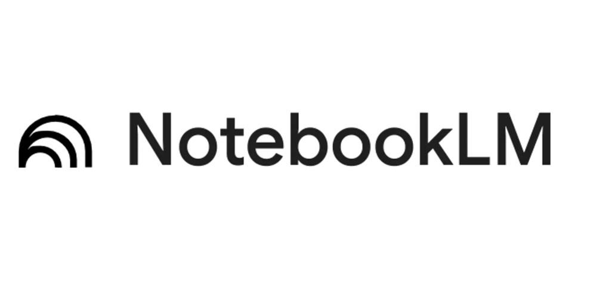
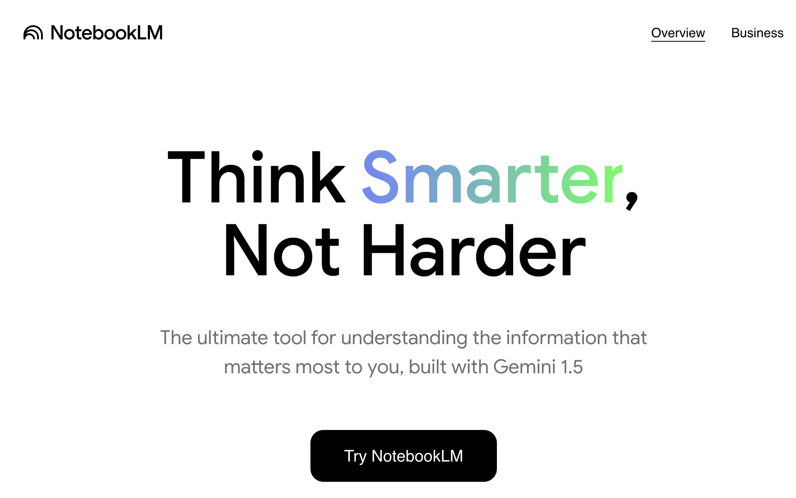
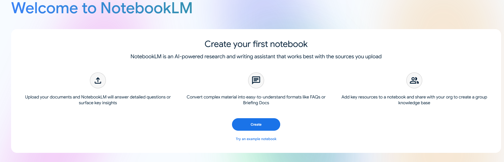
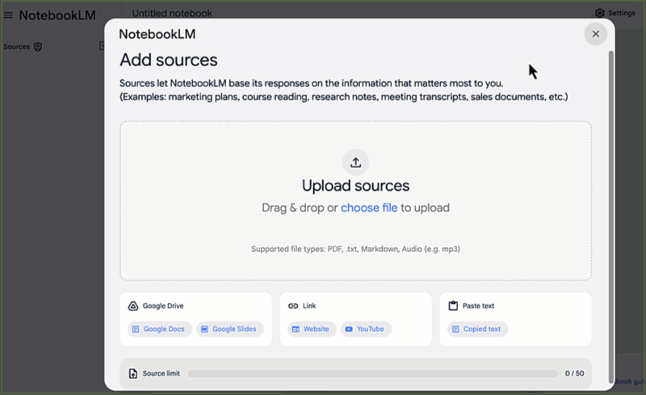
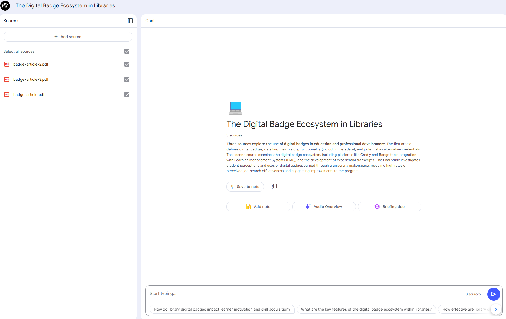
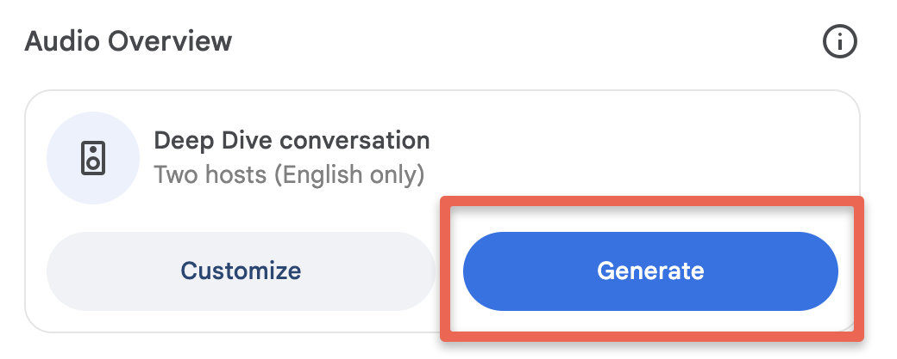
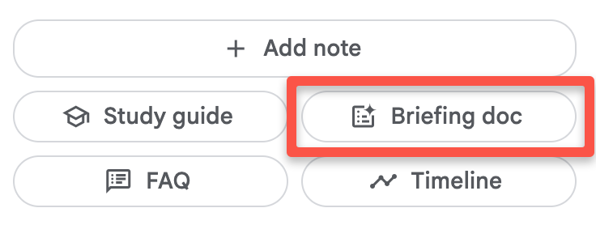
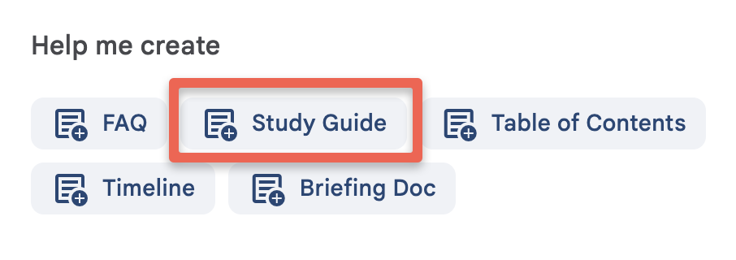
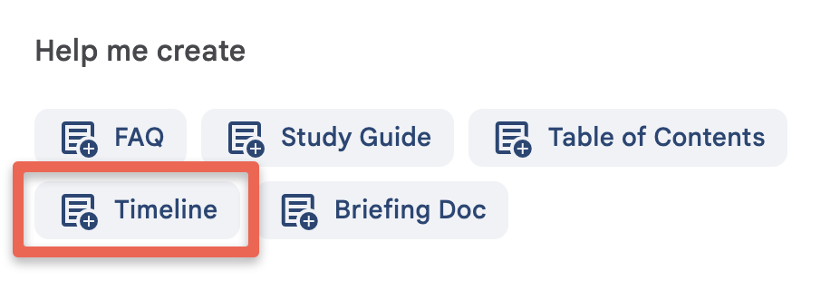
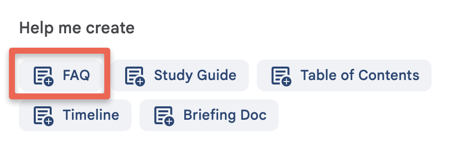

---
layout: default
title: 1 - A Personalized GenAI Assistant
nav_order: 6
parent: Workshop Activities
customjs: http://code.jquery.com/jquery-1.4.2.min.js
--- 
# Getting Started with NotebookLM's _Notebook Guide_ 

"Upload PDFs, websites, YouTube videos, audio files, Google Docs, or Google Slides, and NotebookLM will summarize them and make interesting connections between topics. With all of your sources in place, NotebookLM gets to work and becomes a personalized AI expert in the information that matters most to you. NotebookLM provides clear citations for its work, showing you the exact quotes from your sources. NotebookLM does not use your personal data, including your source uploads, queries, and the responses from the model for training." ([NotebookLM](https://notebooklm.google/){:target="_blank"}, 2024)

> NOTE: Like all other Generative AI tools, NotebookLM will sometimes make mistakes, although because you are providing it with training data, it will likely make fewer mistakes than general purpose Generative AI tools. Always research any factual claims it makes if you are not a subject area expert. 

If you have any questions or get stuck as you work through this exercise, please ask the instructor for assistance.

## Logon to NotebookLM
- If you haven't already, please navigate to the [NoteBookLM website](https://notebooklm.google/){:target="_blank"}.
- Click on the black **Try NoteboolLM** button and then log on with a Google or Gmail account.
> NOTE: If you don't have a Google or Gmail account you'll need to click on the small **Create account** link to create an account before you can log in to NotebookLM. If you have any problems logging in, please ask your instructor for help.

<br>

## Create a Notebook & Add Documents to It
Before we can start testing, we need to create a new notebook and add some documents and media to it so that it has some source documents to train on and draw from.

1. Download each of the following three documents to use as training data for your notebook in this activity, and please make note of where your web browser is saving them (usually in your Downloads or Desktop folders):
   - [Document 1](images/badge-article.pdf){:target="_blank"}
   - [Document 2](images/badge-article-2.pdf){:target="_blank"}
   - [Document 3](images/badge-article-3.pdf){:target="_blank"}
2. Create a new notebook by clicking on the blue **Create** button.
<br>
3. Upload the three documents you downloaded by clicking on the blue **choose file** link in the middle of the page.
<br>
4. Good job! You're now ready to explore the Notebook guide.
   
## Exploring the Notebook Guide 
1. Each individual article will have a summary when you click it on the left side pannel of the sources.
   - For all 3 articles it will be visible (see photo example), the sentence starts with Three sources explore the use of digital badges in education and professional development... An expert in informal credentialling (or badging) has reviewed the summary, and it is an accurate summary of the information contained in the three journal articles.
<br>
> **NOTE: You should always double-check the accuracy of the facts and claims made by NotebookLM (and all other GenAI tools), as they sometimes make mistakes or hallucinate.
> Note: There are several minor hallucinations in the Notebook Guide. The notebook guides DOES NOT provide citations that can be easily fact-check making it more difficult to verify its facts and claims.**
2. **Podcast Summary**:
  - To create a podcast summary, all you need to do is click on the blue **Generate** button **-OR-** You can also click on the **Customize** button to give NoteBookLM more context before it generates the podcast summary. For example you can click on the Customize button and type: ```The audience for this podcast are parents who are sending a child to university for the first time, and are concerned about the job prospects for their child after graduation.```
  - It typically takes between two and five minutes to generate the podcast, and the podcasts seem to be about 10 to 18 minutes long depending on how much information it needs to summarize.<br>
<br>
  - Once the podcast has been generated, you can listen to the podcast by clicking on the light blue play button.
  - To download the podcast to your computer to share with other people click on the **three vertical dots** to the right of the play button and then click on the **Download** button.
  - If you don't want to wait for NotebookLM to create the podcast you can listen to the version it created for the DSC: [Podcast Summary Audio](images/nblm-podcast-summary.mp3){:target="_blank"} (12-min).
  > - **Reflection**: What do you think of the quality of the Podcast it created?
  > - **Reflection**: Can you think of any ways that this type of Podcast summary could be useful?
  > - **Reflection**: Are there any potential drawbacks or problems you can think of with this type of GenAI-created Podcast summary?
3. **Briefing Document**:
  - Briefing documents are a quick way to understand the contents of the documents in your notebook. **NOTE**: NotebookLM does not provide inline citations in this type of document like it does when it responds to your prompts, which makes verifying factual claims more time-consuming.
  - To create a briefing document simply click on the **breifing doc** button. It will take 30-60 seconds to generate the briefing guide unnder notes (this will be titled a Digital Badges: Comprehensive Overview).<br>
    <br>
  > - **Reflection**: What do you think of the quality of the Briefing Document?
  > - **Reflection**: Can you think of any ways that you would find this kind of summary useful?
  > - **Reflection**: Are there any potential drawbacks or problems you can think of with this type of GenAI-created summary?
6. **Study Guide**:
  - Study guides are a great way to test your knowledge of a topic using GenAI-generated short answer questions with the answers to those questions available to you to check to see how you did.
  - The study guide also contains essay questions, with no answers, and a glossary of terms that could potentially be quite helpful.
  - To create a study guide simply click on the **Study Guide** button. It will take 30-60 seconds to generate the study guide.<br>
    <br>
  > - **Reflection**: What do you think of the quality of the Study Guide questions and answers?
  > - **Reflection**: Can you think of any ways that you would find this kind of Study Guide useful?
  > - **Reflection**: Are there any potential drawbacks or problems you can think of with this type of GenAI-created study guide?
7. **Timeline**:
  - The Timeline summary lists major events recorded in all of the documents in chronological order. This can be quite helpful especially when you are working with more than one or two documents, as NotebookLM nicely organizes them by date with a short summary for each.
  - To create a timeline simply click on the **Timeline** button. It will take 30-60 seconds to generate the timeline.<br>
    <br>
  > - **Reflection**: What do you think of the quality of the Timeline dates and summaries? Did it miss anything?
  > - **Reflection**: Can you think of any ways that you would find a Timeline useful?
  > - **Reflection**: Are there any potential drawbacks or problems you can think of with this type of GenAI-created Timeline?
8. **Frequently Asked Questions**:
  - The Frequently Asked Questions feature creates a summary for each of the documents in your notebook. This could help you identify which document contains specific information or a particular concept.
  - To create a timeline simply click on the **Timeline** button. It will take 30-60 seconds to generate the timeline.<br>
    <br>
  > - **Reflection**: What do you think of the quality of the Frequently Asked Questions (FAQ)?
  > - **Reflection**: Could the FAQ be helpful for studying or reviewing in a course?
  > - **Reflection**: Are there any potential drawbacks or problems you can think of with this type of GenAI-created FAQs?

Note: there is no more **table of contents** feature or button. 

## Chatting with Your Notebook
In the following activities, we'll experiment with some interactive chat techniques with the documents to explore what else NotebookLM can do for you!
  
[NEXT STEP: Text/Audio/Video Summarization](2-nblm-summarization){: .btn .btn-blue }
