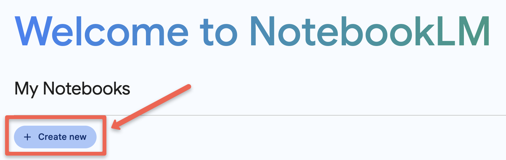
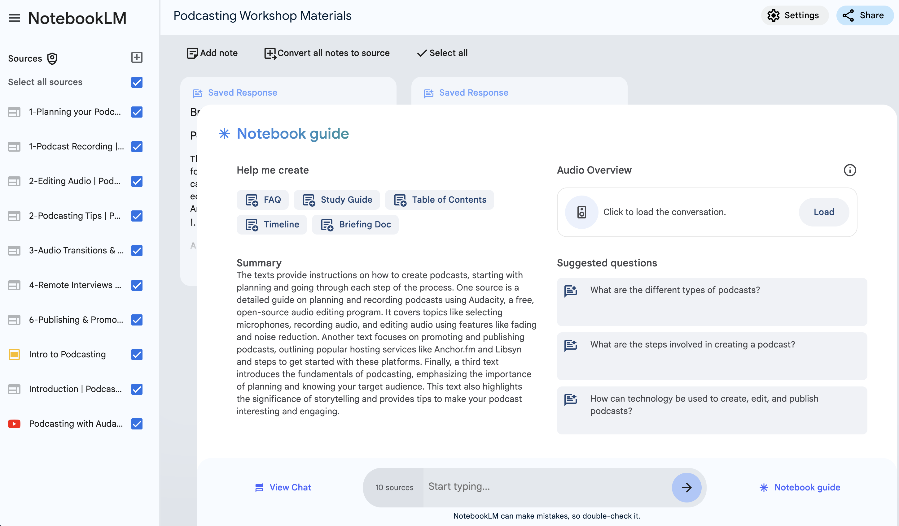

---
layout: default
title: 1 - NotebookLM Personal Cloud GenAI
nav_order: 6
parent: Workshop Activities
customjs: http://code.jquery.com/jquery-1.4.2.min.js
--- 
# NotebookLM Your Personalized Cloud-Based Assistant 

"Upload PDFs, websites, YouTube videos, audio files, Google Docs, or Google Slides, and NotebookLM will summarize them and make interesting connections between topics. With all of your sources in place, NotebookLM gets to work and becomes a personalized AI expert in the information that matters most to you. NotebookLM provides clear citations for its work, showing you the exact quotes from your sources. NotebookLM does not use your personal data, including your source uploads, queries, and the responses from the model for training." ([NotebookLM](https://notebooklm.google/){:target="_blank"}, 2024)

> NOTE: Like all other Generative AI tools, NotebookLM will sometimes make mistakes, although because you are providing it with training data, it will make fewer mistakes than general purpose Generative AI tools. Always double-check any factual claims it makes if you are not a subject area expert. 

If you have any questions or get stuck as you work through this GPT4All exercise, please ask the instructor for assistance.

## Logon to NotebookLM
- If you haven't already, please navigate to the [NoteBookLM website](https://notebooklm.google/){:target="_blank"}.
- Click on the black **Try NoteboolLM** button and then log on with a Google or Gmail account.
> NOTE: If you don't have a Google or Gmail account you'll need to click on the small **Create account** link to create an account before you can log in to NotebookLM. If you have any problems logging in, please ask your instructor for help.

 

## Create a Notebook & Add Documents to It
Before we can start testing, we need to create a new notebook and add some documents and media to it so that it has some source documents to train on and draw from.

1. Download each of the following three documents to use as training data for your notebook in this activity, and please make note of where your web browser is saving them (usually in your Downloads or Desktop folders):
   - [Document 1](https://isam2022.hemi-makers.org/wp-content/uploads/sites/3/2022/09/031..pdf){:target="_blank"}
   - [Document 2](images/Digital_Badges_in_Education-libre.pdf){:target="_blank"}
   - [Document 3](images/6985-18529-1-PB.pdf){:target="_blank"}
3. Create a new notebook by clicking on the blue **Create new** button on the left side of the screen.
 
4. Upload the three documents you downloaded in Step 1 to your new notebook...
# Put new image here...
6. Your Notebook should look like this now:
 
7. 
## Exploring the Notebook Guide 
1. Click on the **Notebook Guide** button on the bottom right of the window. You should now see the notebook guide window.
 
2. Podcast Summary:
3. Briefing Document:
4. Study Guide:
5. Timeline
6. Table of Contents:

## Chatting with Your Notebook
Now let's try some interactive chats with your document to explore what else NotebookLM can do...
  
[NEXT STEP: Earn a Workshop Badge](excel-chat.html){: .btn .btn-blue }
