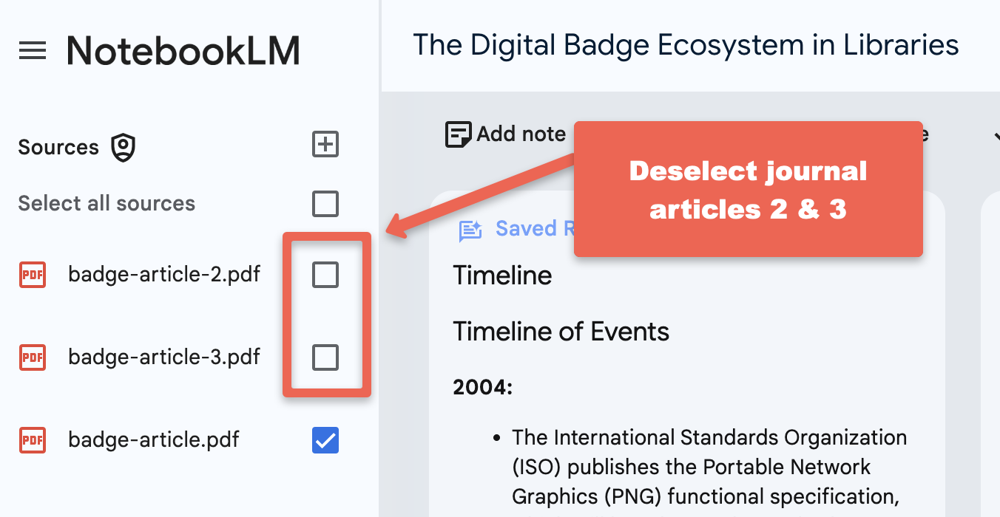

---
layout: default
title: 2 - NotebookLM Summarization Use Cases
nav_order: 7
parent: Workshop Activities
customjs: http://code.jquery.com/jquery-1.4.2.min.js
--- 
# Summarizing Text, Audio, & Video 

In this workshop, we'll explore how GenAI can help you quickly summarize meeting notes, including action items. We'll also discover how to customize these summaries by adjusting the tone, style, and language level. Have you ever needed to create a summary in a different language for a colleague or student? We'll show you how AI can translate your text with ease. 

> NOTE: Like all other Generative AI tools, NotebookLM will sometimes make mistakes, although because you are providing it with training data, it will likely make fewer mistakes than general purpose Generative AI tools. Always research any factual claims it makes if you are not a subject area expert. 

If you have any questions or get stuck as you work through this exercise, please ask the instructor for assistance.

## Summarize a Single Journal Article with a Purpose in Mind
Instead of summarizing all three journal articles we're going to direct NoteBookLM to summarize just one of the articles and then give it a specific focus for the summary to assist us in drafting promotional materials for a University Library Makerspace (or Library Digital Scholarship Commons).
1. De-select articles 2 and 3 in the Sources area on the left side of the web page.
<br>
2. In the chat area type: ```Create a promotional message to parents explaining how the University Makerspace (or Library Digital Scholarship Commons) can help their children with job searches for co-op positions and for their post-graduation job search.```
   - Does the text NoteBookLM response look helpful?
   - Are there any inaccuracies?
   - Feel free to give it follow-up prompts if you notice anything you'd like changed (or you could manually change the message yourself of course in your favourite document editor.
3. Let's assume that the message is accurate and the tone is appropriate but is too long. Let's ask NotebookLM to make it shorter:
   - In the chat area type: ```Shorten the promotional message to 100 words.```
   - How does that look? Maybe too short?
   - Let's try again and make it a little bit longer: ```Shorten the promotional message to 150 words.```
   - How does it look now? Better? Worse? Feel free to play around with this giving NotebookLM additional instructions on length, tone, and audience (maybe have it craft a message for students duing their first week of classes?)
4. Can you think of any other ways you could summarize the journal article for a specific purpose?
   - How about summarizing it for 5 key points for an academic poster you need to create based on an article you wrote: ```Provide me with 5 one-sentence bullet points to help me create an academic poster for a Makerspace conference poster session.``
   - Does the text NoteBookLM response look helpful?
   - Are there any inaccuracies?
   - Feel free to give it follow-up prompts of course
5. You have been invited to speak to a group of grade 5 students about the research you did on Makerspace badging (assuming you wrote the article that is selected in NotebookLM).
   - In the chat area type: ```Summarise the article into a 10-minute speech for a group of grade 5 students. Make the speech upbeat and engaging. Include a short story to illustrate how fun makerspaces are and how badges are cool and helpful.```
   - Does the text NoteBookLM response look helpful?
   - Are there any inaccuracies?
   - Feel free to give it follow-up prompts if you notice anything you'd like changed (or you could manually change the message

## Summarize Meeting Notes
We're going to summarize a transcription of a meeting held via Zoom for a fictitious "Makerspace Executive Weekly Meeting" in a new notebook:
1. Create a new notebook:
   - Click on the **NotebookLM logo** on the top right of the screen, which will take you out of the current notebook and to the main NotebookLM screen.
   - Click on the blue **Create new** button on the left side of the screen. You're in a new notebook now.
<br>
2. Add the PDF of the meeting notes:
   - Download the meeting transcription document to use as training data for your notebook in this activity, and please make note of where your web browser is saving them (usually in your Downloads or Desktop folders): [Meeting Transcription](images/nblm-meeting-notes.pdf){:target="_blank"}
   - Upload the Meeting document you downloaded by clicking on the blue **choose file** link in the middle of the page, then **navigate** to where you just downloaded the document, **select the document** and **open it**.
3. Prompt for a general summary

## Create Action Items for Each Individual in the Meeting
1. Prompt for action items to be completed by individuals and unassigned action items...
2. Prompt for a summary of suggested projects

1. Download each of the following three documents to use as training data for your notebook in this activity, and please make note of where your web browser is saving them (usually in your Downloads or Desktop folders):
   - [Document 1](images/badge-article.pdf){:target="_blank"}
   - [Document 2](images/badge-article-2.pdf){:target="_blank"}
   - [Document 3](images/badge-article-3.pdf){:target="_blank"}
2. Create a new notebook by clicking on the blue **Create new** button on the left side of the screen.
<br>
3. Upload the three documents you downloaded by clicking on the blue **choose file** link in the middle of the page.
<br>
4. Good job! You're now ready to explore the Notebook guide.
   
## Translated Summaries & Action Items
1. Click on the **Notebook Guide** button on the bottom right of the window. You should now see the notebook guide window.
<br>
   - Read the Summary that NotebookLM has created. An expert in informal credentialling (or badging) has reviewed the summary, and it is an accurate summary of the information contained in the three journal articles.
> **NOTE: You should always double-check the accuracy of the facts and claims made by NotebookLM (and all other GenAI tools), as they sometimes make mistakes or hallucinate.
> Note: There are several minor hallucinations in the Notebook Guide. The notebook guides DO NOT provide citations that allow you to easily fact-check its responses making it more difficult to verify facts and claims.**
3. **Podcast Summary**:
  - To create a podcast summary, all you need to do is click on the blue **Generate** button. It typically takes between two and five minutes to generate the podcast, and the podcasts seem to be about 10 to 18 minutes long depending on how much information it needs to summarize.<br>
<br>
  - Once the podcast has been generated, you can listen to the podcast by clicking on teh light blue play button.
  - To download the podcast to your computer to share with other people click on the **three vertical dots** to the right of the play button and then click on the **Download** button.
  - If you don't want to wait for NotebookLM to create the podcast you can listen to the version it created for the DSC: [Podcast Summary Audio](images/nblm-podcast-summary.mp3){:target="_blank"} (12-min).
  > - **Reflection**: What do you think of the quality of the Podcast it created?
  > - **Reflection**: Can you think of any ways that this type of Podcast summary could be useful?
  > - **Reflection**: Are there any potential drawbacks or problems you can think of with this type of GenAI-created Podcast summary?

## Try Summarizing Your Own Class or Meeting Notes
1. Start here...
   - more...

[NEXT STEP: Brainstorming Stragegies](nblm-brainstorming.html){: .btn .btn-blue }
