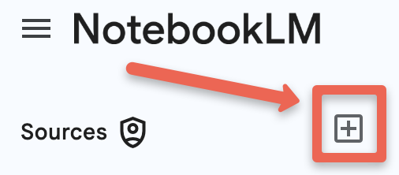
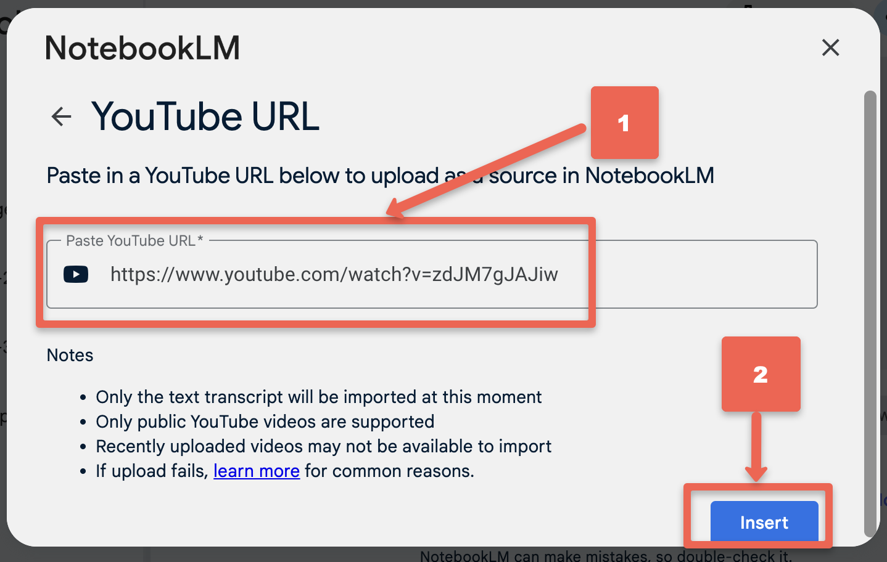

---
layout: default
title: 3 - NotebookLM Brainstorming
nav_order: 8
parent: Workshop Activities
customjs: http://code.jquery.com/jquery-1.4.2.min.js
--- 
# Brainstorming & Ideation for Research Questions

In this workshop, we'll explore how GenAI can help you explore a group of journal articles and a video for gaps in the literature and potential research questions to fill those gaps or explore a related topic. 

> NOTE: Like all other Generative AI tools, NotebookLM will sometimes make mistakes, although because you are providing it with training data, it will likely make fewer mistakes than general purpose Generative AI tools. Always research any factual claims it makes if you are not a subject area expert. 

If you have any questions or get stuck as you work through this exercise, please ask the instructor for assistance.

## Getting Started
Let's go back to the notebook with the three journal articles we've already created, and add a YouTube video to the notebook so that there will be four items for NotebookLM to draw information from:

1. Click on the **NotebookLM logo** on the top right of the screen, which will take you out of the current notebook and to the main NotebookLM screen.
2. Click on the **The Digital Badge Ecosystem in Libraries** notebook.
4. Click on the **Add Source** button above the list of journal articles in this notebook.<br>
<br>
5. Click on the **YouTube** button in the bottom middle of the page.<br>
<br>
7. Next **paste the following web address** into the text box: ```https://www.youtube.com/watch?v=zdJM7gJAJiw```<br>
<br>

## Initial Exploration  
1. Create a list of possible limitations or gaps in the articles and video by typing the following into the chat box and press Enter: ```What are the most significant limitations or gaps mentioned in these studies?```
  > - **Reflection**: Do the limitations and gaps look reasonable?
2. Identify some possible surprising or counterintuitive insights from the journal articles and video by typing the following into the chat box and press Enter: ```Extract 2-3 surprising or counterintuitive insights from these journal articles.```
  - **Reflection**: Are the insights supported by the citations that link to the parts of the article that support the insights?
3. Identify contradictory findings or interpretations between these journal articles. Type the following into the chat box and press Enter: ```Identify any contradictory findings or interpretations between these studies.```
  - **Reflection**: Are the contradictory findings supported by the citations?
4. Identify common themes or research questions shared by these articles. Type the following into the chat box and press Enter: ```What common themes or research questions emerge when examining these articles together?```
  - **Reflection**: Do the themes and research questions look reasonable based on what you've read in the articles?

## Research Question Generation  
1. Create a list of possible research questions by typing the following into the chat box and press Enter: ```Based on the limitations and gaps mentioned in all three journal articles, propose 3-4 potential research questions that could address these gaps.```
  > - **Reflection**: Do the research questions look reasonable?
2. Suggest interdisciplinary research questions that combine methodological approaches from these articles by typing the following into the chat box and press Enter: ```Suggest interdisciplinary research questions that combine methodological approaches from all sources.```
  > - **Reflection**: Do these research questions look more or less interesting to you than the research questions generated by the previous prompt?
3. Ask for an emerging list of research areas or technologies that could provide new insights by typing the following into the chat box and press Enter: ```What emerging research areas or technologies could provide new insights into the topics covered in all the sources?```
  > - **Reflection**: Do any of the technologies and/or research areas suggested seem like interesting avenues of research from your perspective?

## Refinement and Evaluation
1. Look at all the research questions generated in the previous three prompts and choose 3 of the strongest research questions and then include them in the following prompt (replacing Questions A, B, and C with your research questions:
```Evaluate these research questions against the following criteria: originality, feasibility, and potential impacts:```<br>
```  - Question A```<br>
```  - Question B```<br>
```  - Question C```<br>
  > - **Reflection**: How do the critiques for each question look to you?
  > - **Reflection**: Do any of the critiques change your evaluation of how good they are a research questions?
2. Ask NotebookLM to suggest potential methodological approaches for addressing each research question you used in step 1 above (replacing QUESTION A, B, & C with your questions):
  - ```Suggest potential methodological approaches for addressing each generated research question: QUESTION A```<br>
  - ```Suggest potential methodological approaches for addressing each generated research question: QUESTION B```<br>
  - ```Suggest potential methodological approaches for addressing each generated research question: QUESTION C```<br>
3. Next let's see if we can identify any potential challenges or limitations for each research question in turn:
  - ```Suggest potential methodological approaches for addressing each generated research question: QUESTION A```<br>
  - ```Suggest potential methodological approaches for addressing each generated research question: QUESTION B```<br>
  - ```Suggest potential methodological approaches for addressing each generated research question: QUESTION C```<br>

## OPTIONAL: Work Through This Activity With Your Own Topic!
If you have a research topic of your own in mind and have found some articles related to the topic, you might want to try working through this activity from the beginning on your own in a new notebook with your own articles. If you have any problems or questions, please ask the workshop instructor for support.

> ## Workshop Tips Review
> - Use clear, specific prompts
> - Iterate and refine questions
> - Consider multiple perspectives
> - Be open to unexpected insights

[NEXT STEP: Summarize Short Answer Survey Feedback](nblm-summarize-survey-text.html){: .btn .btn-blue }
