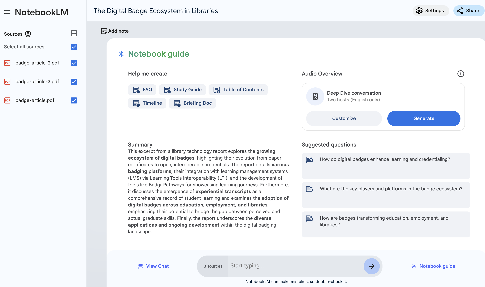

---
layout: default
title: 3 - NotebookLM Brainstorming
nav_order: 8
parent: Workshop Activities
customjs: http://code.jquery.com/jquery-1.4.2.min.js
--- 
# Brainstorming & Ideation

In this workshop, we'll explore how GenAI can help you quickly summarize meeting notes, including action items. We'll also discover how to customize these summaries by adjusting the tone, style, and language level. Have you ever needed to create a summary in a different language for a colleague or student? We'll show you how AI can translate your text with ease. 

> NOTE: Like all other Generative AI tools, NotebookLM will sometimes make mistakes, although because you are providing it with training data, it will likely make fewer mistakes than general purpose Generative AI tools. Always research any factual claims it makes if you are not a subject area expert. 

If you have any questions or get stuck as you work through this exercise, please ask the instructor for assistance.

Outline:
- For research
- For leasure
- More?

## Research: Brainstorming and Ideation  
- If you haven't already, please navigate to the [NoteBookLM website](https://notebooklm.google/){:target="_blank"}.
- Click on the black **Try NoteboolLM** button and then log on with a Google or Gmail account.
> NOTE: If you don't have a Google or Gmail account you'll need to click on the small **Create account** link to create an account before you can log in to NotebookLM. If you have any problems logging in, please ask your instructor for help.

 

## Leasure: Brainstorming and Ideation
Before we can start testing, we need to create a new notebook and add some documents and media to it so that it has some source documents to train on and draw from.

1. Download each of the following three documents to use as training data for your notebook in this activity, and please make note of where your web browser is saving them (usually in your Downloads or Desktop folders):
   - [Document 1](images/badge-article.pdf){:target="_blank"}
   - [Document 2](images/badge-article-2.pdf){:target="_blank"}
   - [Document 3](images/badge-article-3.pdf){:target="_blank"}
2. Create a new notebook by clicking on the blue **Create new** button on the left side of the screen.
 
3. Upload the three documents you downloaded by clicking on the blue **choose file** link in the middle of the page.
 
4. Good job! You're now ready to explore the Notebook guide.
   
## ???
1. Click on the **Notebook Guide** button on the bottom right of the window. You should now see the notebook guide window.
 
   - Read the Summary that NotebookLM has created. An expert in informal credentialling (or badging) has reviewed the summary, and it is an accurate summary of the information contained in the three journal articles.
> **NOTE: You should always double-check the accuracy of the facts and claims made by NotebookLM (and all other GenAI tools), as they sometimes make mistakes or hallucinate.
> Note: There are several minor hallucinations in the Notebook Guide. The notebook guides DO NOT provide citations that allow you to easily fact-check its responses making it more difficult to verify facts and claims.**
3. **Podcast Summary**:
  - To create a podcast summary, all you need to do is click on the blue **Generate** button. It typically takes between two and five minutes to generate the podcast, and the podcasts seem to be about 10 to 18 minutes long depending on how much information it needs to summarize. 
 
  - Once the podcast has been generated, you can listen to the podcast by clicking on teh light blue play button.
  - To download the podcast to your computer to share with other people click on the **three vertical dots** to the right of the play button and then click on the **Download** button.
  - If you don't want to wait for NotebookLM to create the podcast you can listen to the version it created for the DSC: [Podcast Summary Audio](images/nblm-podcast-summary.mp3){:target="_blank"} (12-min).
  > - **Reflection**: What do you think of the quality of the Podcast it created?
  > - **Reflection**: Can you think of any ways that this type of Podcast summary could be useful?
  > - **Reflection**: Are there any potential drawbacks or problems you can think of with this type of GenAI-created Podcast summary?
  
[NEXT STEP: Summarize Short Answer Survey Feedback](nblm-summarize-survey-text.html){: .btn .btn-blue }
