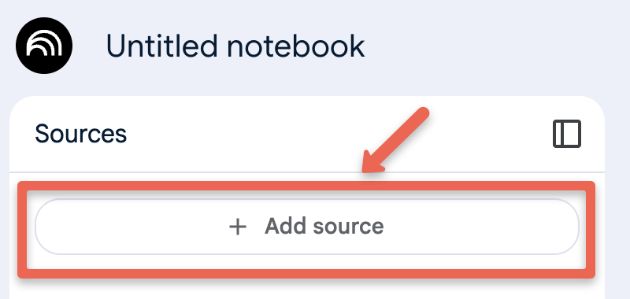
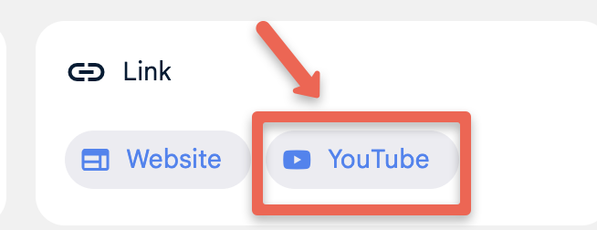
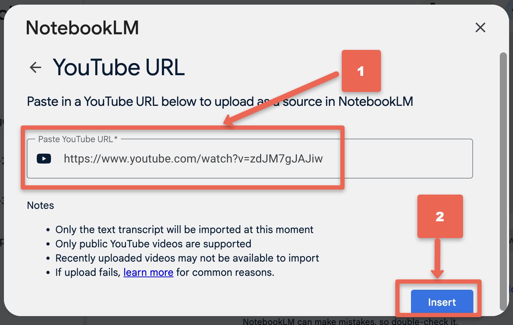

# Brainstorming & Ideation for Research Questions

In this activity you'll use NotebookLM to explore a set of journal articles and a video for gaps in the literature, then generate and evaluate potential research questions to address those gaps.

> **Note:** Like all GenAI tools, NotebookLM will sometimes make mistakes. Because you are providing your own sources it will likely make fewer than a general-purpose tool — but always verify any factual claims it makes, especially if you are not a subject-area expert.

If you get stuck at any point, ask the instructor.

---

## Learning goals

By the end of this activity, you will be able to:

* Use NotebookLM to **brainstorm questions, angles, and follow-up ideas** grounded in your sources.
* Turn readings into **research questions, project ideas, or assignment prompts**.
* Guide NotebookLM to **build on your own thinking**, not just generate random ideas.
* **Evaluate and refine** research questions against originality, feasibility, and potential impact.
* Capture the best ideas in a reusable format (outline, scored RQ table, or action plan).

---

## Getting started: add a video source

Go back to the notebook with the three journal articles from Activity 2 and add a YouTube video so there are four sources to draw from.

1. Click the **NotebookLM logo** in the top left to return to the home screen.
2. Click on the **The Digital Badge Ecosystem in Libraries** notebook.
3. Click **Add source** above the list of journal articles.

   

4. Click the **YouTube** button at the bottom of the dialog.

   

5. Paste this URL into the text box and confirm:
   `https://www.youtube.com/watch?v=zdJM7gJAJiw`

   

Make sure all four sources are selected before moving on.

---

## 1) Initial exploration

Work through these prompts one at a time. After each response, check whether the claims are supported by the citations before moving on.

**Gaps and limitations**
