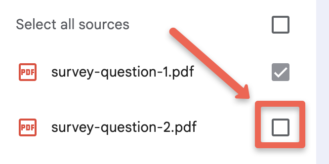
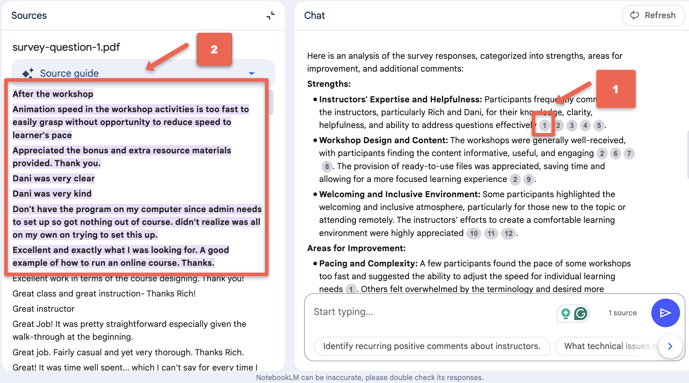
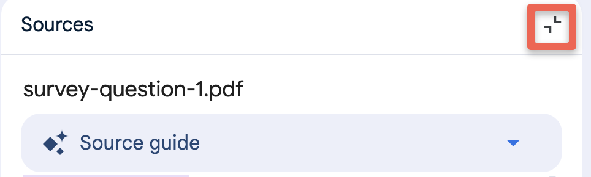
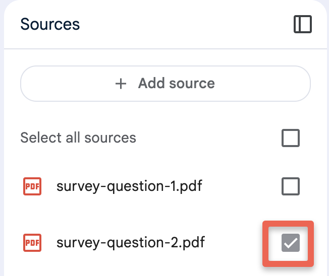

---
layout: default
title: 4 - NotebookLM Summarize Survey Feedback
nav_order: 8
parent: Workshop Activities
customjs: http://code.jquery.com/jquery-1.4.2.min.js
--- 
# Summarize Short Answer Survey Feedback

In this workshop, we'll explore how GenAI can help you summarize short answer survey responses, to help you quickly understand at a high level the key issues being brought up by respondents for a specific survey question. If you asked multiple questions you'd need to upload the responses for each question in individual documents. We'll also review how to customize these summaries by adjusting the tone, style, and language level.  

> NOTE: Like all other Generative AI tools, NotebookLM will sometimes make mistakes, although because you are providing it with training data, it will likely make fewer mistakes than general purpose Generative AI tools. Always research any factual claims it makes when summarizing survey question responses.

If you have any questions or get stuck as you work through this exercise, please ask the instructor for assistance.

Outline:
- Summarize feedback from all responses to a single free-form survey question.
- Use different prompt strategies to customize the summary by using, personas, examples, tone, vocabulary level, and voice.
- Explore the usefulness of NotebookLM citations, in particular how they take you to the passages in the document that they used to support their summary of information. This is a very useful verification tool.

## Getting Started
Let's go back to the notebook with the three journal articles we've already created, and add a YouTube video to the notebook so that there will be four items for NotebookLM to draw information from:

1. Download the following two documents, each with survey question responses, to use as training data for your notebook in this activity. When you do this for your own survey data, please note that you'll need to export the responses for each survey question you want to analyze into separate documents (using either TXT or PDF formats for both). Please make note of where your web browser is saving the survey response PDF files for this exercise (usually in your Downloads or Desktop folders):
   - [Survey Question Response 1](images/survey-question-1.pdf){:target="_blank"}
   - [Survey Question Response 2](images/survey-question-2.pdf){:target="_blank"}
2. Create a new notebook by clicking on the blue **Create new** button on the left side of the screen.
<br>
3. Upload the two documents you downloaded by clicking on the blue **choose file** link in the middle of the page. You'll need to either select the two documents, and add them together, or do as the video below shows and add them individually:<br>
<br>
4. Good job! You're now ready to explore ways to summarize the survey responses!

## Initial Exploration of Survey Question 1 Responses
1. Let's limit our first summary to Survey Question 1 Responses:
   - De-select **survey-question-2.pdf** file by clicking on the checkbox on the right of the file name.<br>
   <br>
   - You will now only be asking questions about the responses to _Survey Question 1_.
3. Let's ask NotebookLM to summarize the responses to _Survey Question 1_ by typing the following into the chat box and pressing Enter: ```Please analyze the following short-answer survey responses from participants who attended a university-level workshop. Summarize the key feedback by identifying recurring themes, specific suggestions for improvement, and notable positive aspects. Highlight actionable insights and any patterns in participant opinions. Present the findings clearly, categorizing them into strengths, areas for improvement, and additional comments or suggestions. Ensure the summary is concise and easy to understand.```
  - **Reflection**: Do the themes and suggestions questions look reasonable based on reading the comments in the _Survey Question 1_ PDF document?
  - **Reflection**: In my response, two instructors are highlighted for being particularly expert and helpful. Do we know if that is because these two instructors teach most of the workshops, and equally expert and helpful instructors teach only a handful of workshops so aren't highlighted by NotebookLM? You don't have the data to evaluate this question, but it would be something to explore if this was your research project.
4. NotebookLM provides linkable citations for the factual claims or interpretations it makes. Let's see if these citations can help validate NotebookLM's claims:
  - Click on the first citation link which is a **1** in a little grey circle.
  - The Source guide with appear on the right side of the NotebookLM interface. Please read the highlighted passage to see if it supports the claim that it's supposed to support. Does it seem accurate?<br>
<br>
  - Click on the second citation link which is a **2** in a little grey circle. Does the highlighted passage support the claim that it's supposed to support?
  - Feel free to check out further citations in the document to see how it's done.
5. Now close the **Source guide** by clicking on the little icon in the top right corner of the Source guide area (see image below).
<br>
6. Let's check our Survey Question 2 responses:
  - Click on the Sources checkbox to select **survey-question-2.pdf** and deselect the **survey-question-1.pdf** document.<br>
  <br>
  - Let's ask NotebookLM to summarize the responses to _Survey Question 2_ by typing the following into the chat box and pressing Enter: ```Please analyze the following short-answer survey responses from participants who attended a university-level workshop. Summarize the key feedback by identifying recurring themes, specific suggestions for improvement, and notable positive aspects. Highlight actionable insights and any patterns in participant opinions. Present the findings clearly, categorizing them into strengths, areas for improvement, and additional comments or suggestions. Ensure the summary is concise and easy to understand.```
  - Note that the summary is shorter for the responses to Survey Question 2. This isn't surprising as about half the number of people responded to this survey questioin compared to Question 1.
  - Try looking at the citations to see how reasonable they look.
  
5. **OLD WORKSHOP MATERIALS BELOW...**
   
## Studio Tools
1. Click on the **Notebook Guide** button on the bottom right of the window. You should now see the notebook guide window.
<br>
   - Read the Summary that NotebookLM has created. An expert in informal credentialling (or badging) has reviewed the summary, and it is an accurate summary of the information contained in the three journal articles.
> **NOTE: You should always double-check the accuracy of the facts and claims made by NotebookLM (and all other GenAI tools), as they sometimes make mistakes or hallucinate.
> Note: There are several minor hallucinations in the Notebook Guide. The notebook guides DO NOT provide citations that allow you to easily fact-check its responses making it more difficult to verify facts and claims.**
3. **Podcast Summary**:
  - To create a podcast summary, all you need to do is click on the blue **Generate** button. It typically takes between two and five minutes to generate the podcast, and the podcasts seem to be about 10 to 18 minutes long depending on how much information it needs to summarize.<br>
<br>
  - Once the podcast has been generated, you can listen to the podcast by clicking on teh light blue play button.
  - To download the podcast to your computer to share with other people click on the **three vertical dots** to the right of the play button and then click on the **Download** button.
  - If you don't want to wait for NotebookLM to create the podcast you can listen to the version it created for the DSC: [Podcast Summary Audio](images/nblm-podcast-summary.mp3){:target="_blank"} (12-min).
  > - **Reflection**: What do you think of the quality of the Podcast it created?
  > - **Reflection**: Can you think of any ways that this type of Podcast summary could be useful?
  > - **Reflection**: Are there any potential drawbacks or problems you can think of with this type of GenAI-created Podcast summary?
  
[NEXT STEP: Creating Presentations](5-nblm-presentations.html){: .btn .btn-blue }
