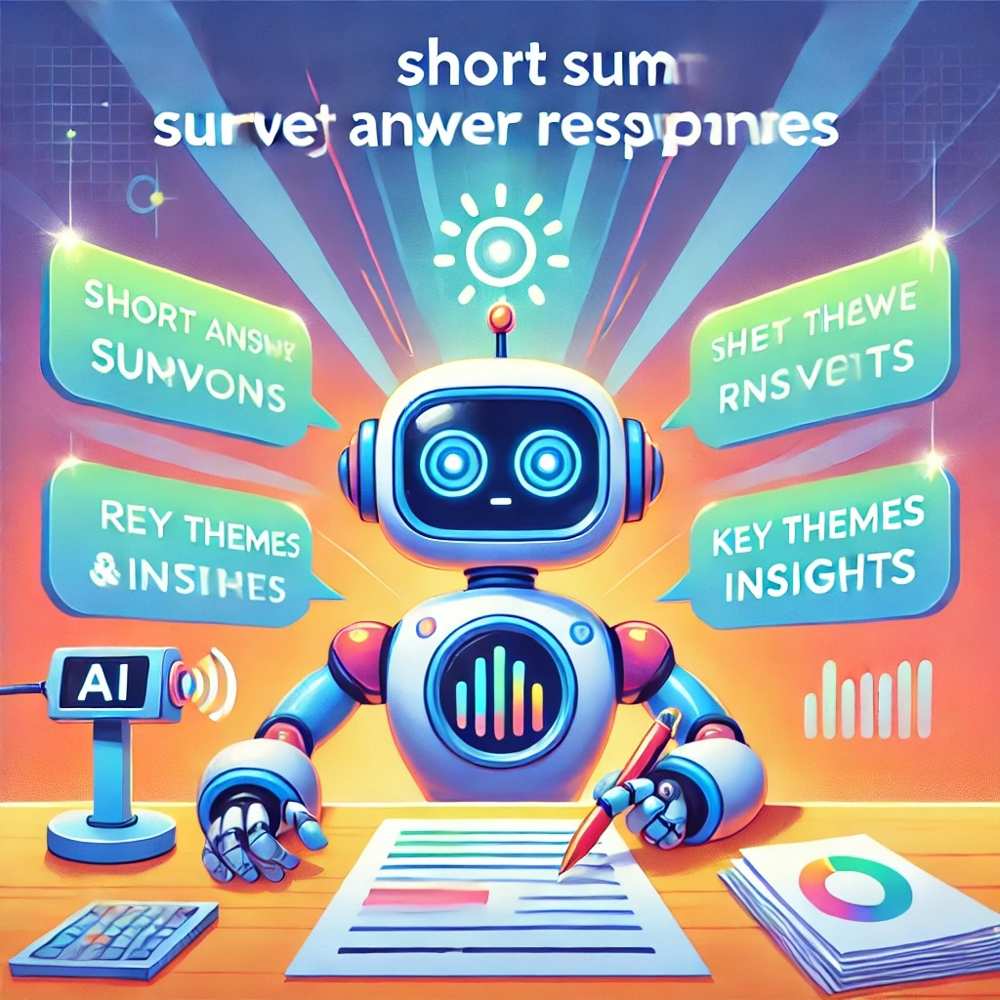
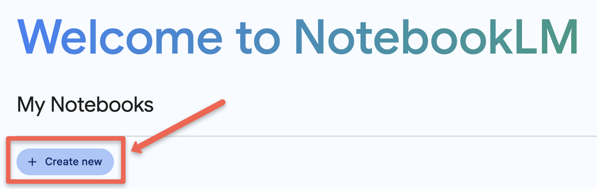
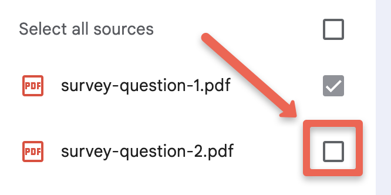
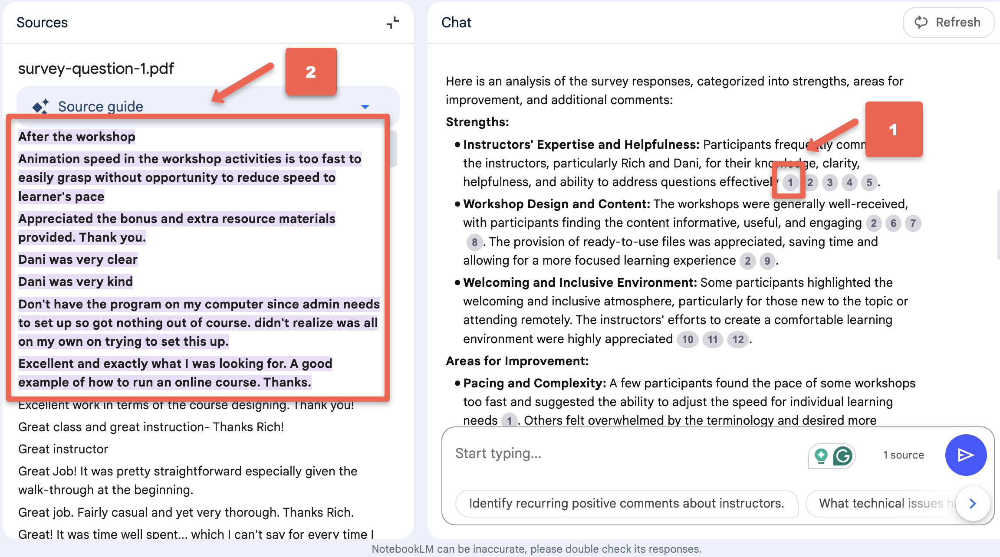
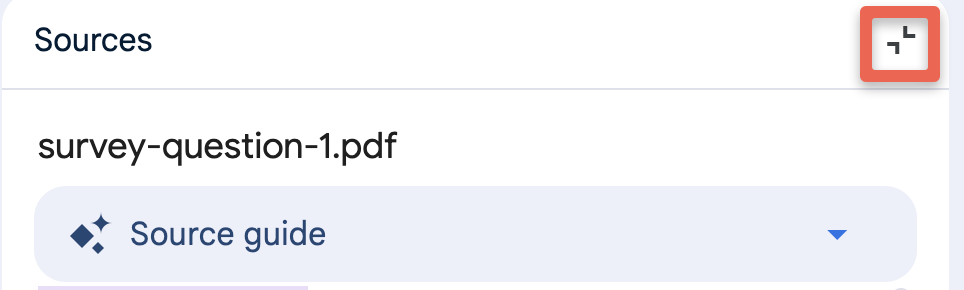
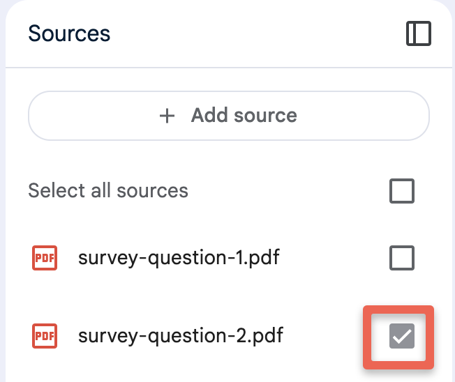
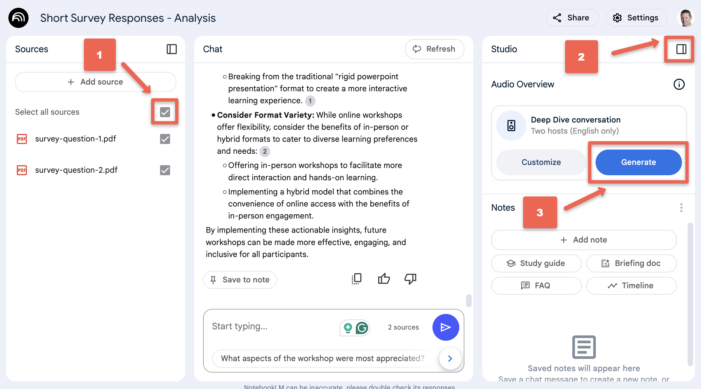

# Summarize Short Answer Survey Feedback



In this activity you'll use NotebookLM to summarize free-text survey responses — helping you quickly identify key themes, patterns, and actionable insights from qualitative data. You'll also learn how to customize summaries by adjusting tone, style, and language level, and how to use NotebookLM's citation tools to verify that its conclusions are actually grounded in what respondents said.

> **Note:** Like all GenAI tools, NotebookLM will sometimes make mistakes. Because you are providing it with your own data it will likely make fewer than a general-purpose tool — but always verify its claims against the original responses, especially before sharing findings with others.

If you get stuck at any point, ask the instructor.

---

## Learning goals

By the end of this activity, you will be able to:

* Load **qualitative survey text** (open-ended responses, comments, reflections) into a NotebookLM notebook.
* Ask NotebookLM to identify **themes, patterns, and representative quotes**.
* Turn messy text into **concise summaries, tables, or reports** for different audiences.
* Use **citations and excerpts** to verify that themes are actually supported by the data.
* Customize summaries by adjusting **tone, persona, and vocabulary level**.

---

## Getting started

1. Download the two sample survey response documents below. Each file contains responses to a single open-ended survey question. When working with your own survey data, export the responses for each question into separate documents (TXT or PDF format work best):
   * [Survey Question Response 1](images/survey-question-1.pdf)
   * [Survey Question Response 2](images/survey-question-2.pdf)
2. In NotebookLM, click the blue **Create new** button to start a fresh notebook.

   

3. Upload both documents by clicking **Choose file** and selecting them.

   

4. Confirm both files appear in the **Sources** panel. You're now ready to start summarizing.

---

## 1) Initial exploration — Survey Question 1

1. De-select **survey-question-2.pdf** by clicking its checkbox so that NotebookLM only draws from Question 1 responses.

   

2. Paste this prompt to generate your first summary:
```
Please analyze the following short-answer survey responses from participants
who attended a university-level workshop. Summarize the key feedback by
identifying recurring themes, specific suggestions for improvement, and
notable positive aspects. Highlight actionable insights and any patterns
in participant opinions. Present the findings clearly, categorizing them
into: Strengths | Areas for improvement | Additional comments & suggestions.
Ensure the summary is concise and easy to understand.
```

3. Read the output and reflect:
   * Do the themes look reasonable compared to what you can see in the PDF?
   * If two instructors are highlighted as particularly helpful — do you actually know whether that's because they teach most workshops, or just because they're mentioned more often? NotebookLM can't answer that without more data. Note the limitation.

**Verify the citations:**

4. Click the **1** citation marker (small grey circle) in the response. The Source panel will open on the right — read the highlighted passage and ask: does it actually support the claim?

   

5. Click the **2** citation marker and repeat. Check as many as you have time for — this is the most important habit to build with any AI summarization tool.

6. Close the Source panel using the icon in the top-right corner of that panel.

   

---

## 2) Survey Question 2

1. Switch sources: select **survey-question-2.pdf** and de-select **survey-question-1.pdf**.

   

2. Run the same summary prompt as above. Notice that the output is shorter — this is expected since fewer people responded to Question 2.

3. Try a follow-up to push for more depth:
```
Please expand on the Actionable Insights section. For each insight,
suggest one concrete next step a workshop organizer could take,
and cite the response(s) that support it.
```

4. Check two citations to see if the suggested actions are genuinely grounded in what respondents said.

> **Reflection:** Could this workflow save you time when analyzing your own survey data? What would you still need to do manually that NotebookLM can't do for you?

---

## 3) Customize tone, persona & language level

The same data can be summarized very differently depending on who will read the report. Practice switching context:

**Version A — For a senior administrator (formal, action-oriented)**
```
Summarize the key findings from Survey Question 1 responses as a
150-word executive briefing for a dean or department head.
Formal tone. Lead with the single most important finding.
End with two recommended actions. Include citations.
```

**Version B — For the workshop team (conversational, detailed)**
```
Summarize the same responses as a casual internal memo for the
workshop instructors who ran the session. Friendly tone.
Include specific quotes from participants (cited) that illustrate
the main strengths and the main area to improve.
Maximum 200 words.
```

**Version C — Plain language (for a public-facing report)**
```
Write a 120-word plain-language summary of the survey findings
suitable for publishing on a library website. Grade 8 reading level.
No jargon. No citations needed — just clear, honest findings.
```

> **Reflection:** Which version was most accurate? Which needed the most editing? What does that tell you about where to use NotebookLM and where to write from scratch?

---

## 4) Studio tools

Select all sources before using the Studio tools — click **Select all sources** at the bottom of the Sources panel, then open the **Studio** pane on the right side of the screen.



### Podcast / Audio Overview

The Audio Overview turns your survey data into a short conversational podcast-style summary — useful for sharing findings with people who won't read a report.

1. Click the blue **Generate** button under Audio Overview. Generation takes 2–5 minutes.
2. Listen to the first 2–3 minutes and ask yourself:
   * Does it accurately represent the main themes?
   * Does it oversimplify or miss anything important?
   * Would you share this with a colleague as a fair summary of the data?
3. To download: click the **three vertical dots** next to the play button → **Download**.

> If you don't want to wait, listen to this pre-generated example: [Podcast Summary Audio](images/nblm-podcast-summary.mp3) (12 min).

**Acceptance criteria before sharing an Audio Overview:**
* Main themes match what you found in manual review
* No claims that contradict the source data
* Tone is appropriate for your intended audience

### Briefing document

A Briefing Doc gives you a structured written summary of everything in the notebook — useful as a starting point for a formal report.

1. Click **Briefing Document** in the Studio panel. It takes 30–60 seconds.
2. Click the document link that appears and scan through it.
3. Note: unlike chat responses, Briefing Docs do **not** include inline citations — which makes verifying claims more time-consuming. Don't share a Briefing Doc without manually spot-checking key claims against the source PDFs.

> **Reflection:** Given the lack of inline citations, when would you use a Briefing Doc vs. asking questions in the chat?

### FAQ

The FAQ tool generates a list of questions and answers based on your sources. For survey data it can surface questions that respondents implicitly raised but didn't state directly.

1. Click **FAQ** and scan the output.
2. Ask: are these questions actually grounded in what respondents said, or are they generic?
3. Follow up with:
```
Which of these FAQ items is most directly supported by the survey
responses, and which is the most speculative? Explain with citations.
```

### Study guide & timeline

* **Study Guide** — most useful for course content, not survey data. Try it and see if anything useful comes out for your context.
* **Timeline** — only works if responses contain dates or time references. Try it — if the responses contain no dates, NotebookLM will tell you.

---

## Self-check (2 min)

* Did you **verify at least two citations** by clicking them and reading the source passage?
* Did you produce summaries for **at least two different audiences** (Sections 2 and 3)?
* Did you identify at least **one limitation** of NotebookLM's analysis that you would need to address manually?
* Before sharing any Audio Overview or Briefing Doc, did you check it against the **acceptance criteria**?

---

## Badge evidence

Save a screenshot of:
1. A summary output with at least one citation clicked and verified.
2. One of your customized tone/persona versions (Version A, B, or C from Section 3).

---

[NEXT STEP: Article to Presentation](5-nblm-presentations.html)
