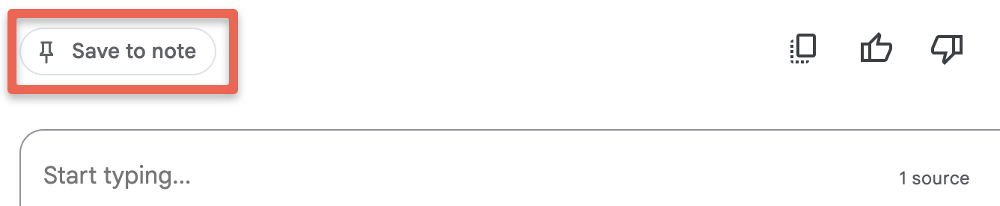

---
layout: default
title: 5 - Article to Presentation
nav_order: 8
parent: Workshop Activities
customjs: http://code.jquery.com/jquery-1.4.2.min.js
--- 
# TO BE COMPLETED in December 2024!
# Presentations Assistance

In this workshop, you'll create a script along with slide titles for a Presentation with Google Slides or Microsoft PowerPoint. If you want you could also use [Meta.ai](https://www.meta.ai/){:target="_blank"} to create images that you could potentially use for your slides.

> NOTE: Like all other Generative AI tools, NotebookLM will sometimes make mistakes, although because you are providing it with training data, it will likely make fewer mistakes than general purpose Generative AI tools. Always research any factual claims it makes if you are not a subject area expert. 

If you have any questions or get stuck as you work through this exercise, please ask the instructor for assistance.

## Getting Started
1. **If you completed the first activity in this workshop**: Please use the notebook from the first activity with the 3 badging journal articles. To do this:

  -  Return to the NotebookLM home page with the 3 articles by first clicking the **black circular NotebookLM logo** in the top left of the web application.
  
  -  Next, click on the **The Digital Badge Ecosystem in Libraries** notebook to get into the notebook we'll be using for this activity.
2. **If you haven't completed the first activity**, No worries! Please complete the following first two steps of this workshop's starter activity before returning here to continue on to learn how you can use NotebookLM to assist you in creating a presentation:
  - [Logon to NotebookLM](1-nblm-notebook.html#create-a-notebook--add-documents-to-it){:target="_blank"}
  - [Create a Notebook & Add Documents to It](1-nblm-notebook.html#create-a-notebook--add-documents-to-it){:target="_blank"}

## Create a Presentation Speaker Notes Based on One Article
Unlike the first activity in this workshop where we used three articles as training data, in this activity we are using only one of them to create a presentation (in either PowerPoint or Google Slides). This is to replicate a typical use case where you've written an assignment or journal article and need to create an accompanying presentation for it. Let's get started:

1. Click on the checked boxes beside, **badge-article-2.pdf** & **badge-article-3.pdf** to deselect these two articles so that NoteboolLM will only use the one remaining selected article to respond to your prompts.
2. In the chat box at the bottom of the page copy and paste the following prompt: ```Please help me create a 10 minute long presentation, with slide titles, and detailed speaker notes, with minimal text on the slides. The audience is a group of graduate students and professors. Start the presentation with an interesting and compelling story.```
3. Read over the summary...
  > - What has it done well?
  > - What has it not done well?
4. Click on the grey Save to note button on the bottom left of the bottom left of the web page. Note that after you click the button, a few item with appear in the bottom half of the "Studio" panel. 

6. Copy and paste into a Word or Google Doc...

## Upgrade the Presentation
7. Prompt for a better intro story...
8. Title
3. In the chat box at the bottom of the page type: Create a Google Slides presentation summary.
  - Review the presentation text to make sure there are not mistakes or inaccuracies.
4. In the chat box at the bottom of the page type: Create an image for each slide.
  - Other prompts: Create an image for each slide in an abstract style, with a consistent colour pallet across all the images.
> - **Reflection**: Are there any potential drawbacks or problems you can think of with this type of GenAI-created Podcast summary?

   
## Create Imagery for Each Slide
5. Go to Meta.ai to create the images (as of December 2024 the free Google Gemini image creator is not nearly as good as the free Meta.ai image generator:
- Create a blank Google Slide or PowerPoint presentation:
- Reflections:
  - Would creating the text summary of the presentation save you time?
    - How much editing of the text would you need to do to get it to a quality level you’d be happy with (if any)?
    - Were there any factual errors in the presentation text?
    - Are there any major points or concepts that NotebookLM missed?
  - Would creating the images for the presentation save you time?
    - Are you happy with the quality of the images?
    - What other options do you have to include imagery in your presentations?
  - What are potential moral and legal issues that the GenAI companies are dealing with about the training data they are using to create these images?

<br>

  
  
[NEXT STEP: Local GenAI - Getting Started](6-local-genai-intro.html){: .btn .btn-blue }
