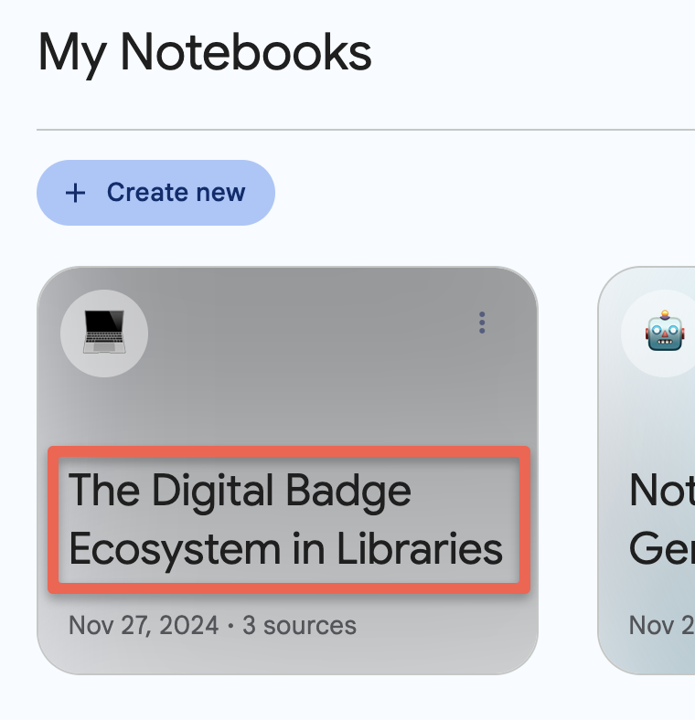
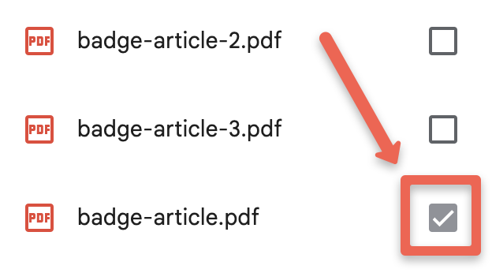
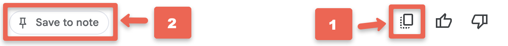
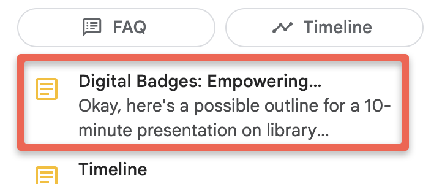
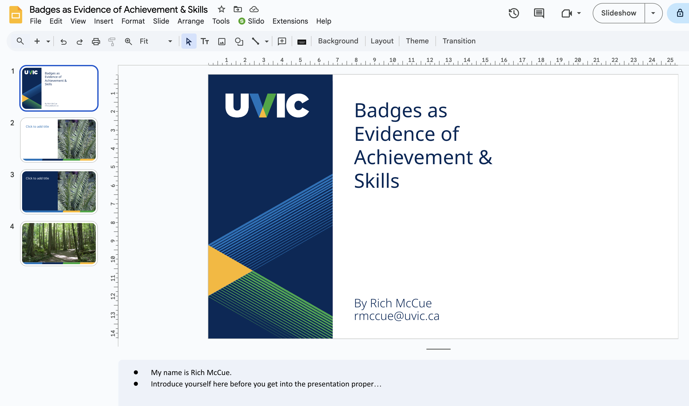
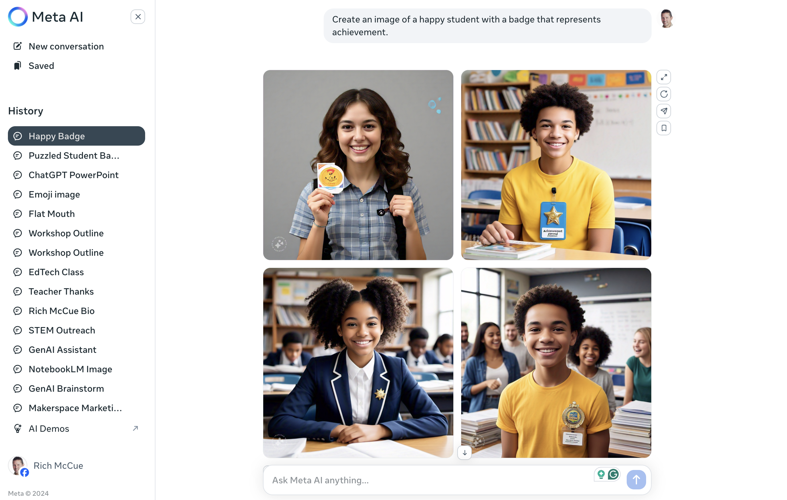

---
layout: default
title: 5 - Article to Presentation
nav_order: 8
parent: Workshop Activities
customjs: http://code.jquery.com/jquery-1.4.2.min.js
--- 
# Convert an Article to a Presentation

In this workshop, you'll create a script along with slide titles for a presentation using Google Slides or Microsoft PowerPoint. If you want you could also use [Meta.ai](https://www.meta.ai/){:target="_blank"} to create images that you could potentially use for your slides.

> NOTE: Like all other Generative AI tools, NotebookLM will sometimes make mistakes, although because you are providing it with training data, it will likely make fewer mistakes than general purpose Generative AI tools. Always research any factual claims it makes if you are not a subject area expert. 

If you have any questions or get stuck as you work through this exercise, please ask the instructor for assistance.

## Getting Started
1. **If you completed the first activity in this workshop**: Please use the notebook from the first activity with the 3 badging journal articles. To do this:

  -  Return to the NotebookLM home page with the 3 articles by first clicking the **black circular NotebookLM logo** in the top left of the web application.
  
  -  Next, click on the **The Digital Badge Ecosystem in Libraries** notebook to get into the notebook we'll be using for this activity.
2. **If you haven't completed the first activity**, No worries! Please complete the following first two steps of this workshop's starter activity before returning here to continue on to learn how you can use NotebookLM to assist you in creating a presentation:
  - [Logon to NotebookLM](1-nblm-notebook.html#create-a-notebook--add-documents-to-it){:target="_blank"}
  - [Create a Notebook & Add Documents to It](1-nblm-notebook.html#create-a-notebook--add-documents-to-it){:target="_blank"}
3. Unlike the first activity in this workshop where we used three articles as training data, in this activity we are using only one of them to create a presentation (in either PowerPoint or Google Slides). This is to replicate a typical use case where you've written an assignment or journal article and need to create an accompanying presentation for it.

  - Click on the checked boxes beside, **badge-article-2.pdf** & **badge-article-3.pdf** to deselect these two articles so that NoteboolLM will only use the one remaining selected article to respond to your prompts.
4. If you haven't created a PowerPoint or Google Slides document to start recording suggestions from NotebookLM, now would be a good time to create one.
   - If you'd like, you can use a [UVic presentation template](https://docs.google.com/presentation/d/1fuhWOJu_sq0ivUTY1Ul2h0t7Kff2wZZ0Y5NSnEMh0bY/template/preview){:target="_blank"} in Google Slides, or you can create your template. Make sure to be logged into your Gmail or Google account before you click on the blue **Use Template** button on the top right of the window.
   - If you choose to use the UVic template, feel to to pick and choose from the three different styles of the template. 

## Catchy Presentation Titles
Get your presentation off to a good start with a catchy presentation title. Let's get some suggestions from NotebookLM:
1. In the chat box at the bottom of the page copy and paste the following prompt: ```Suggest some attention-grabbing, catchy titles for my presentation at an academic conference to draw in my audience, who will consist of my academic peers.```
   - How do the suggestions look? Are there any that look appropriate and catchy for the audience you'll be presenting to?
   - If none of the titles look appropriate, you might want to give NotebookLM a follow-up prompt something like this: ```Give me 5 more suggested presentation titles that are no longer than 6 words long.```
   - Copy and paste the title you like best and paste it into the title slide of your presentation. The title I've chosen given my goals for the presentation is: _Badges as Evidence of Achievement & Skills_.

## Create Presentation Speaker Notes Based on an Article
Now we'll prompt NotebookLM to suggest ideas for speaker notes, with minimal text on each slide. Research shows that text-heavy slides read by presenters are more difficult to member than slides with a title, image, and minimal additional text that are narrated by the presenter. With that in mind, we will craft a prompt to help suggest slide titles and detailed speaker notes with minimal text on the slides (to conform with the best practices from Multimedia Learning Theory, in order to help people watching the presentation remember more of it).
1. In the chat box at the bottom of the page copy and paste the following prompt: ```Create a 10-minute long presentation, with slide titles, and detailed speaker notes, with minimal text on the slides. The audience is a group of graduate students and professors. Start the presentation with an interesting and compelling story. Use as many slides as necessary keeping in mind that I like to use a lot of large images in my presentations.```
2. Copy the suggested speaker notes and paste them into your working document:
   - The easiest way to do this is to click on the **Copy** button at the bottom of the chat, and then **Paste** the text into a **Google Doc** or **Microsoft Word document** to edit the text suggested by NotebookLM.
   - Click on the **Save to note** button on the left to keep a copy of the chat for future reference.

3. Now that the presentation outline is in an editable Google or Word document you can personalize the content, wording, and ordering, as well as correct any factual errors that it's made. As you read the suggested text, ask yourself the following questions as you edit and improve the text: 
> - What has it done well?
> - What has it not done well?
> - What mistakes had it made?
> - Will using NotebookLM save me any time compared to creating the presentation on my own?
> - What edits do I need to make to the suggested text?

4. Note, that if you clicked on the **Save to note** button, the saved note will appear in the bottom half of the "Studio" panel on the right of the web app. The auto-generated title for my note was, "**Digital Badges: Empowering...**" 

## Build & Customize Your Presentation Title Slide & Speaker Notes
Now that you have a title, and draft presentation outline with speaker notes, it's time to start to build and customize the presentation in Google Slides or the PowerPoint document you created in the Getting Started portion of this activity:
1. Select the title slide that you want to use and populate it with your **presentation title**, and if you want, **your name** and **email address**.

2. Feel free to delete any of the templates that don't fit the look or feel you want for your presentation. As you can see in the image above, I deleted all but four of the template slides on the left-hand side of the screen for my presentation.
3. Now let's create an image for your title slide:
  - Let's go to the [Meta.ai](https://www.meta.ai/){:target="_blank"} website to create an image for the title slide (as of December 2024 Google's free Gemini image creator is not nearly as good as the free Meta.ai image generator). **NOTE**: You'll need to log in to Meta.ai using either a Facebook or Instagram account to create images.
  - **Copy** and **Paste** the following prompt into Meta.ai chat box and press **Enter** on your keyboard to create an image for your title slide: ```Create an image of a happy student with a badge that represents achievement.```<br>

  - **Right mouse click** on the image you'd like to use and then select **Copy Image**. Note: Browsers other than Google's Chrome browser might use slightly different language from "Copy Image."
  - Go to the title slide in your presentation and **Paste** the image you just created onto the slide. Then move, resize and crop the image. See the video below for details on how to [create, copy, paste, move, resize & crop an image](https://www.youtube.com/watch?v=qCegOGderKA){:target="_blank"}<br>
<iframe width="780" height="500" src="https://www.youtube.com/embed/qCegOGderKA" title="Create an Image for my Presentation using Meta.ai" frameborder="0" allow="accelerometer; autoplay; clipboard-write; encrypted-media; gyroscope; picture-in-picture" allowfullscreen></iframe>

> **Reflection**: Are there any potential drawbacks or problems you can think of when creating images for your presentations using GenAI tools?

## Build All Other Presentation Slides & Speaker Notes
1. Copy & paste the title & Speaker notes for the first slide..
2. Does anything need editing or updating?
3. Create an image for the slide by going to [Meta.ai](https://www.meta.ai/){:target="_blank"}
   - Prompt suggestions here...
4. Repeat this for each slide until the end of the presentation...

## Reflection
> **Title generation**:
>  - Would creating the title for the presentation using NotebookLM save you time? 
>  - How much editing of the text would you need to do to get it to a quality level you’d be happy with (if any)?
> **Text generation**:
>  - Would creating the text summary of the presentation using NotebookLM save you time? 
>  - How much editing of the text would you need to do to get it to a quality level you’d be happy with (if any)?
>  - Were there any factual errors in the presentation text?
>  - Are there any major points or concepts that NotebookLM missed?
> **Image generation**:
>  - Would creating the images for the presentation save you time?
>  - Are you happy with the quality of the images?
>  - What other options do you have to include imagery in your presentations?
>  - Are there any potential moral and legal issues around the images, videos, audio and text the GenAI companies are using for training data?

[NEXT STEP: NEXT ACTIVITY HERE](6-NEW-LINK-HERE.html){: .btn .btn-blue }
