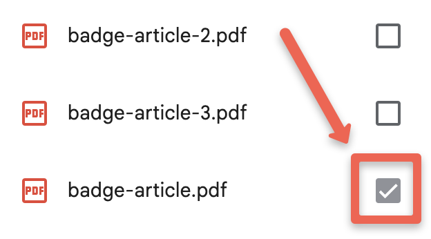

# Convert an Article to a Presentation


You've written an essay or journal article and now need to create a conference presentation? In this activity you'll use NotebookLM to generate a structured outline, slide titles, and speaker notes — then use Meta.ai to create images for each slide.

> **Note 1:** Check with your instructor before using NotebookLM to help create a presentation for assessed work.
> **Note 2:** NotebookLM will sometimes make mistakes. Because you are providing your own sources it will likely make fewer than a general-purpose tool — but always verify factual claims before presenting.

If you get stuck at any point, ask the instructor.

---

## Learning goals

By the end of this activity, you will be able to:

* Use NotebookLM to generate a **presentation outline** from one or more sources.
* Turn summaries into **slide titles, minimal slide text, and detailed speaker notes**.
* Adjust slide content for **different audiences and time limits**.
* Use **acceptance criteria** to critically review AI-generated slides before using them.
* Create **AI-generated images** with Meta.ai and evaluate them for appropriateness.

---

## Getting started

**If you completed Activity 1:** Use the notebook from that activity with the 3 badging journal articles.

* Click the **black circular NotebookLM logo** in the top left to return to the home screen.
* Click on the **The Digital Badge Ecosystem in Libraries** notebook.

**If you haven't completed Activity 1:** Complete these two steps first, then return here:

* [Log on to NotebookLM](1-nblm-notebook.html)
* [Create a notebook & add documents](1-nblm-notebook.html#step-1--create-your-first-notebook)

---

## 1) Select a single source

In this activity we use only **one** article to replicate a typical use case: you've written an assignment or paper and need to build a presentation from it.

1. In the **Sources** panel, de-select **badge-article-2.pdf** and **badge-article-3.pdf** so only one article is active.



2. If you haven't already, create a blank **Google Slides** or **PowerPoint** document to paste content into as you go. You can use the [UVic presentation template](https://docs.google.com/presentation/d/1fuhWOJu_sq0ivUTY1Ul2h0t7Kff2wZZ0Y5NSnEMh0bY/template/preview) in Google Slides if you'd like a head start.

---

## 2) Generate a catchy title

Start with a title that will draw in your audience.

1. Paste this prompt into the chat box:
```
Suggest 5 attention-grabbing titles for a 10-minute academic conference
presentation based on this article. The audience is graduate students
and professors. Each title should be no longer than 8 words.
```

2. If none feel right, follow up with:
```
Give me 5 more titles that are more specific to the article's key finding
and no longer than 6 words.
```

3. Paste your chosen title into the title slide of your presentation.

**Acceptance criteria for a good title:**
* Under 8 words
* Specific to the article's main finding (not generic)
* Would make someone in the audience want to stay and listen

---

## 3) Generate slide outline & speaker notes

Research shows that text-heavy slides read aloud by presenters are harder to remember than slides with a title, one image, and minimal text narrated by the speaker. We'll prompt NotebookLM to follow that principle.

1. Paste this prompt:
```
Create a 10-minute presentation outline based on the selected article.
For each slide provide:
- Slide title (max 6 words)
- Slide text (max 15 words — key point only, no full sentences)
- Detailed speaker notes (150–200 words the presenter will say out loud)
- A one-sentence image prompt I can paste into an AI image generator

Start with a compelling story or surprising fact from the article.
Use as many slides as needed for a 10-minute talk.
The audience is graduate students and professors.
```

2. Click **Save to note** to keep a copy, then click **Copy** and paste the full output into your working Google Doc or Word document.


**Acceptance criteria — check every slide against these before using:**

| Criterion | What to check |
|---|---|
| Accurate | Does the slide text match what the article actually says? Click the citation to verify. |
| Concise | Is the slide text under 15 words? Cut anything longer. |
| Speaker notes complete | Do the notes give you enough to speak for ~60 seconds per slide? |
| Story-led opening | Does the first slide open with something compelling, not just a title card? |
| Audience-appropriate | Would a graduate student or professor find the level and terminology right? |

---

## 4) Build each slide

For each slide in your outline, repeat these steps:

**Add the title and text**
1. Duplicate a template slide (right-click → **Duplicate slide**).
2. Paste the slide title into the title block.
3. Paste the minimal slide text into the body — use **Paste and match style** to avoid formatting issues.

**Add speaker notes**
1. Paste the speaker notes into the notes area below the slide.
2. Read them aloud — do they flow naturally? Edit anything that sounds like AI wrote it.

**Create an image with Meta.ai**
1. Go to [meta.ai](https://www.meta.ai/) — you'll need a Facebook or Instagram account.
2. Paste the image prompt NotebookLM suggested for that slide.
3. If the result doesn't fit, try a follow-up like:
   `Make the image more realistic and less cartoonish` or
   `Change the setting to a university library.`
4. Right-click the image you want → **Copy image**.
5. Paste it onto the slide, then resize and crop to fit.

> **Reflection:** Are there any moral or legal concerns with using AI-generated images in an academic presentation? What would you do if you weren't sure about the image's origins?

---

## 5) Critical review before you present

Before you consider the presentation done, work through this checklist:

**Fact-check**
```
Review the speaker notes you generated for this presentation.
List any factual claims that are not directly supported by a citation
in the source article. Mark each as VERIFIED or NEEDS CHECK.
```

Go back to the article and manually verify every NEEDS CHECK item.

**Audience fit**
```
Read through the full presentation outline. Identify any slide where
the language is too technical, too simple, or uses jargon the audience
may not know. Suggest a rewrite for those slides only.
```

**Timing check**
```
Estimate how long this presentation will take to deliver if each slide
gets the full speaker notes read at a natural pace. Is it under 10 minutes?
If not, suggest which slides to cut or combine.
```

---

## Reflection

**Title generation**
* Did NotebookLM produce a title you'd actually use, or did you have to write your own?

**Text & speaker notes**
* How much editing did the speaker notes need before they sounded like you?
* Were there any factual errors or missing key points from the article?

**Image generation**
* Would you use AI-generated images in a real academic presentation? Why or why not?
* What royalty-free alternatives exist if you decide not to? (e.g., [Pexels](https://pexels.com), [Unsplash](https://unsplash.com))

---

## Self-check (2 min)

* Does every slide meet the **acceptance criteria** from Section 3?
* Have you **verified factual claims** by clicking citations in NotebookLM?
* Are your speaker notes **edited** so they sound like you, not an AI?
* Is the presentation under **10 minutes** when read at a natural pace?

---

## Badge evidence

Save a screenshot of:
1. Your completed title slide with the AI-generated image.
2. One set of speaker notes before and after your edits.

---

[NEXT STEP: Deep Research & Web Sources](6-nblm-deep-research.html)
