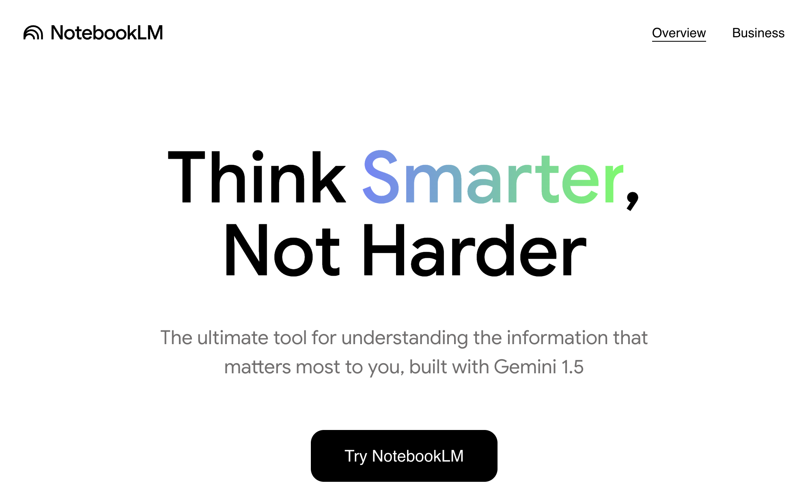

# Deep Research & Web Source Integration



So far in this workshop you've worked exclusively with sources you uploaded yourself. In this activity you'll use NotebookLM's **Deep Research** feature to pull in high-quality web sources, evaluate what it finds, and integrate those results with your existing notebook — all while keeping the critical verification habits you've built in previous activities.

> **Important:** Deep Research pulls from the open web. That means it can find excellent sources — but also outdated, biased, or low-quality ones. Your job is to evaluate what it brings back, not just accept it.

If you get stuck at any point, ask the instructor.

---

## Learning goals

By the end of this activity, you will be able to:

* Use NotebookLM's **Deep Research** feature to search the web from within your notebook.
* **Evaluate the quality and relevance** of web sources it retrieves.
* **Integrate web sources** with your uploaded documents to produce richer, more current syntheses.
* Identify situations where Deep Research **adds value** and situations where it introduces risk.
* Save a structured Deep Research report back into your notebook as a reusable source.

---

## Before you start

Open the **The Digital Badge Ecosystem in Libraries** notebook you built in Activities 1–3. Make sure all three journal articles and the YouTube video are still present in the Sources panel.

---

## 1) What is Deep Research and when should you use it?

Deep Research is NotebookLM's built-in web search mode. When you run a Deep Research query, NotebookLM searches the web, retrieves relevant pages, and produces a structured report — which it can then save directly into your notebook as a new source.

**Use Deep Research when:**
* Your uploaded sources are dated and you need current data or developments.
* You want to check whether findings in your documents are consistent with the broader literature.
* You need statistics, policy documents, or news coverage that wouldn't be in academic PDFs.

**Be cautious when:**
* The topic is nuanced and requires peer-reviewed evidence — web sources vary wildly in quality.
* You are writing for academic submission — always check whether web sources meet your citation standards.
* The query is too broad — Deep Research works best with specific, scoped questions.

---

## 2) Run your first Deep Research query

1. In the chat box, click the **Deep Research** button (the icon looks like a magnifying glass with a sparkle — its exact position may vary by UI version). If you don't see it, look for a toggle or dropdown near the chat input.
2. Type this query and run it:
```
What are the most recent developments in digital badging and
micro-credentialing in higher education since 2022? Focus on
adoption rates, employer recognition, and platform innovations.
Include sources with publication dates.
```

3. Wait for the report to generate — this typically takes 1–3 minutes.
4. When the report appears, read through it and note:
   * How many sources did it cite?
   * What is the date range of the sources?
   * Are any sources from organizations you recognize as credible?

---

## 3) Evaluate the sources it retrieved

Before using anything from a Deep Research report, run this evaluation on the sources it cited.

**For each source ask:**

| Question | What to check |
|---|---|
| Who published it? | Is it a university, government body, reputable organization, or unknown site? |
| When was it published? | Is it recent enough for your purpose? |
| Does the URL match the claim? | Click the link and confirm the page exists and says what the report claims. |
| Is it peer-reviewed? | Web sources rarely are — note this limitation if using for academic work. |
| Is it behind a paywall? | If so, NotebookLM may have summarized a preview only — check what it actually had access to. |

**Run this verification prompt:**
```
For each source you cited in the Deep Research report, provide:
- Publisher name
- Publication date
- URL
- One sentence describing what that source specifically contributed to the report
Flag any source where you are uncertain about credibility or date with "(NEEDS CHECK)".
```

> **Reflection:** How many sources came back with a (NEEDS CHECK) flag? What does that tell you about relying on Deep Research for academic work vs. general background research?

---

## 4) Save the report to your notebook

1. At the bottom of the Deep Research report, click **Save to notebook** (or **Add to sources** — exact label varies by UI version).
2. The report now appears as a new source in your Sources panel, labeled something like "Deep Research — [your query]."
3. Select only this new source and ask:
```
What does this Deep Research report add that was NOT already covered
in the three journal articles in this notebook?
List 3–5 specific new findings or data points with citations.
```

4. Now select all sources (three articles + video + Deep Research report) and ask:
```
Produce a 300-word synthesis of what we now know about digital badging
in higher education, drawing on both the journal articles and the
Deep Research report. Where the sources agree, state the consensus.
Where they disagree or the web sources are more current, note the update.
Include inline citations for every claim.
```

> **Reflection:** Did the Deep Research report update, contradict, or simply confirm what the journal articles said? Which result would you find most useful in your own research workflow?

---

## 5) Scope a second Deep Research query

Now practice writing a well-scoped query on a topic of your own choice.

**A poorly scoped query (avoid this):**
`Tell me about AI in education.`

**A well-scoped query (aim for this):**
`What evidence exists from 2023–2025 on the use of AI-generated feedback tools in undergraduate writing courses in Canada? Include studies or reports with measurable outcomes.`

1. Write your own well-scoped Deep Research query on a topic relevant to your studies or work.
2. Run it and evaluate the sources using the table in Section 3.
3. Save the report to your notebook.
4. Ask NotebookLM to compare what this report adds vs. what is already in your sources.

---

## 6) Know the limits

Run this prompt to make NotebookLM reflect on what it couldn't find:
```
Based on the Deep Research report you generated, what important
questions about digital badging remain unanswered by the sources
you retrieved? What types of sources — that you did not find —
would be needed to answer them?
```

> **Reflection:** Is NotebookLM good at recognizing its own blind spots? How would you go about finding the missing sources it identified?

---

## Self-check (2 min)

* Did you **evaluate every source** the Deep Research report cited using the table in Section 3?
* Did you **save the report** to your notebook and use it as a source in a synthesis?
* Did you write your **own scoped query** (Section 5) and evaluate its results?
* Can you clearly explain to someone when Deep Research is useful and when it introduces risk?

---

## Badge evidence

Save a screenshot of:
1. Your Deep Research report with at least one source flagged as (NEEDS CHECK) and your reason why.
2. The cross-source synthesis from Section 4 with citations from both the journal articles and the Deep Research report.

---

[NEXT STEP: K-12 Educators](7-%20k-12-educators.html)
