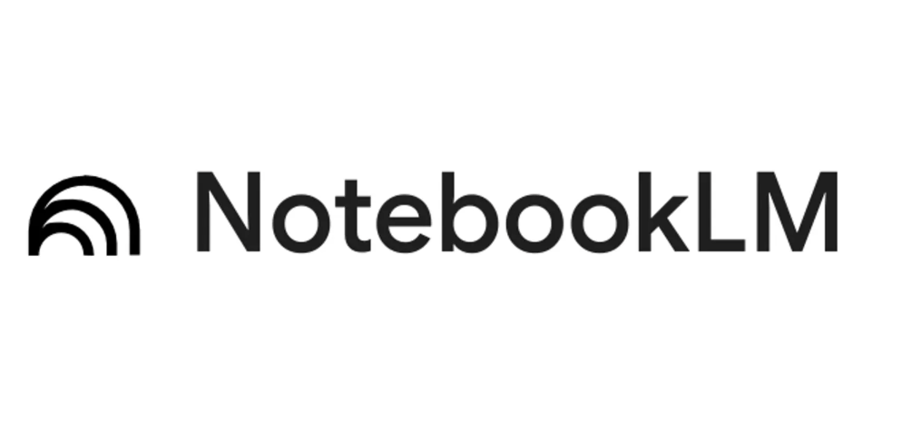

# Teaching Resource: Using NotebookLM in K-12 Education

This activity is designed for K-12 teachers who want to explore how NotebookLM can support classroom learning — both as a tool for teachers to prepare materials, and as a guided tool for students to practise critical thinking, comparison, and comprehension skills.

The example below uses three versions of a well-known fairytale to demonstrate comparison and perspective-taking — skills that connect to the BC curriculum across multiple subject areas and grade levels. The same approach works with any set of texts relevant to your class.

**Curricular connections:**
* [BC Digital Literacy Framework](https://www2.gov.bc.ca/assets/gov/education/kindergarten-to-grade-12/teach/teaching-tools/digital-literacy-framework.pdf)
* [English Language Arts](https://curriculum.gov.bc.ca/curriculum/english-language-arts/3/core) — e.g., "stories can be understood from different perspectives"
* [ADST Curriculum](https://curriculum.gov.bc.ca/curriculum/adst) — applied digital skills and critical evaluation of AI outputs

> **Note:** NotebookLM is a Google product and requires a Google account. Before using it with students, check your district's policies on student data privacy and approved tools. For younger students, consider running the tool as a whole-class demonstration rather than having each student use it individually.

If you get stuck at any point, ask the instructor.

---

## Learning goals

By the end of this activity, you will be able to:

* Set up a **NotebookLM notebook** with multiple texts for classroom comparison activities.
* Use NotebookLM to **generate comparison tools** (T-charts, Venn diagrams, theme summaries) that support BC curriculum outcomes.
* Design **student-facing prompts** that build critical thinking rather than just accepting AI output.
* Use NotebookLM as a **teacher preparation tool** to create lesson plans, differentiated materials, and comprehension questions from your own documents.
* Identify appropriate **grade levels and use cases** for NotebookLM in a K-12 context.

---

## Getting started

1. Download the three versions of *The Three Little Pigs* below. These will be your training documents for this activity:
   * [Document 1](images/3-pigs-1.pdf)
   * [Document 2](images/3-pigs-2.pdf)
   * [Document 3](images/3-pigs-3.pdf)

2. In NotebookLM, click **Create** to start a new notebook. Name it something like "Three Little Pigs — Classroom Demo."

   

3. Upload all three documents.

   

4. Confirm all three appear in the Sources panel and are selected before moving on.

---

## 1) Comparison activities (student-facing)

These prompts work well as whole-class demonstrations or guided individual activities depending on your grade level and available devices.

### Similarities and differences
