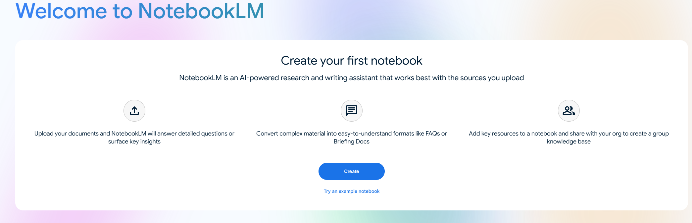
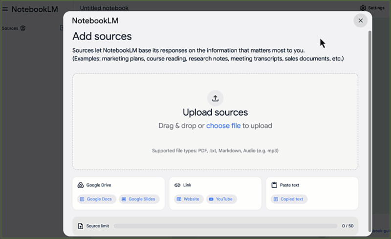

# Teaching Resource: Using NotebookLM in K-12 Education

This activity is designed for K-12 teachers who want to explore how NotebookLM can support classroom learning — both as a tool for teachers to prepare materials, and as a guided tool for students to practise critical thinking, comparison, and comprehension skills.

The example below uses three versions of a well-known fairytale to demonstrate comparison and perspective-taking — skills that connect to the BC curriculum across multiple subject areas and grade levels. The same approach works with any set of texts relevant to your class.

**Curricular connections:**
* [BC Digital Literacy Framework](https://www2.gov.bc.ca/assets/gov/education/kindergarten-to-grade-12/teach/teaching-tools/digital-literacy-framework.pdf)
* [English Language Arts](https://curriculum.gov.bc.ca/curriculum/english-language-arts/3/core) — e.g., "stories can be understood from different perspectives"
* [ADST Curriculum](https://curriculum.gov.bc.ca/curriculum/adst) — applied digital skills and critical evaluation of AI outputs

> **Note:** NotebookLM is a Google product and requires a Google account. Before using it with students, check your district's policies on student data privacy and approved tools. For younger students, consider running the tool as a whole-class demonstration rather than having each student use it individually.

If you get stuck at any point, ask the instructor.

---

## Getting started

1. Download the three versions of *The Three Little Pigs* below. These will be your training documents for this activity:
   * <a href="images/3-pigs-1.pdf" download>Document 1</a>
   * <a href="images/3-pigs-2.pdf" download>Document 2</a>
   * <a href="images/3-pigs-3.pdf" download>Document 3</a>

2. In NotebookLM, click **Create** to start a new notebook. Name it something like "Three Little Pigs — Classroom Demo."

   

3. Upload all three documents.

   

4. Confirm all three appear in the Sources panel and are selected before moving on.

---

## 1. Comparison activities (student-facing)

These prompts work well as whole-class demonstrations or guided individual activities depending on your grade level and available devices.

### Similarities and differences
```
What are the most important similarities and differences between
the three versions of this story?
```

Follow up with:
```
Present those similarities and differences as a T-chart with
two columns: Similarities | Differences.
```

> **Teaching tip:** Have students predict similarities and differences before running the prompt. Compare their predictions to NotebookLM's output — where did they agree? Where did NotebookLM miss something students caught?

### Venn diagram
```
Organize the key differences between the three versions into
a three-circle Venn diagram. List what is unique to each version
and what they all share in the centre.
```

NotebookLM will describe the sections in text. Students can then draw or fill in a physical or digital Venn diagram from that description — connecting the AI output to a hands-on task.

### Perspective and theme
```
How does the perspective of the story change across the three versions?
Which version is most sympathetic to the wolf, and which is most
sympathetic to the pigs? Use evidence from each text.
```

> **Discussion prompt for students:** Do you agree with NotebookLM's answer? Can you find a passage it missed that changes the answer?

### Character and setting details
```
What materials were used to construct each pig's house across
the three versions? Are there any differences in how the houses
are described?
```
```
How is the wolf described differently in each version?
List specific words or phrases used in each text.
```

---

## 2. Comprehension and close reading

Use these prompts to support comprehension activities at different levels.

**Literal comprehension**
```
List five key events that happen in all three versions of the story,
in the order they occur.
```

**Inferential thinking**
```
Why do you think the pigs chose different materials for their houses?
Use evidence from at least two of the three versions to support your answer.
```

**Creative extension**
```
Create a plan for a student's own version of The Three Little Pigs
that is set in a modern city. Include: setting, three main characters,
the conflict, and how it is resolved. Keep it appropriate for
Grade 4 students.
```

> **Teaching tip:** Use the creative extension output as a scaffold, not a finished product. Have students identify one thing they would change and explain why — this keeps the creative thinking with the student.

---

## 3. NotebookLM as a teacher preparation tool

Beyond classroom activities, NotebookLM is a powerful tool for teachers to prepare materials from their own documents. Try these with the Three Little Pigs notebook or swap in your own course readings.

### Generate comprehension questions
```
Create 10 comprehension questions about these three texts,
ranging from literal (Grade 3 level) to inferential (Grade 6 level).
For each question, note the difficulty level and which version(s)
of the story it draws from.
```

### Differentiated reading summaries
```
Write three summaries of the main plot of The Three Little Pigs:
- One for a Grade 2 reading level (simple sentences, no jargon)
- One for a Grade 5 reading level (more detail, some inference)
- One for a Grade 8 reading level (analytical, references themes)
```

### Discussion and debate prompts
```
Generate five discussion or debate prompts based on these texts
that would work for a Grade 5 class. Each prompt should require
students to take a position and support it with evidence from
at least one of the three versions.
```

### Lesson plan outline
```
Create a 60-minute lesson plan outline for a Grade 4 class using
these three versions of The Three Little Pigs. Learning goal:
students will be able to identify how perspective affects the
way a story is told. Include: learning objectives, materials needed,
activity sequence with timing, and one formative assessment idea.
```

> **Important:** Always review any lesson plan or student-facing material NotebookLM generates before using it. Check for factual accuracy, age-appropriateness, and alignment with your actual curriculum outcomes. NotebookLM does not know your students, your school context, or your specific curriculum documents unless you upload them.

---

## 4. Bringing your own classroom texts

The real power of this approach is using texts from your own teaching. Try replacing the Three Little Pigs documents with:

* Two or three versions of a local Indigenous story (with appropriate permissions and cultural guidance)
* Multiple news articles on the same event written for different audiences
* Primary source documents from a Social Studies unit
* Different editions or adaptations of a novel your class is reading

**Prompt to get started with your own texts:**
```
I have uploaded [describe your documents here]. I am teaching
[grade level] students and the curriculum outcome I am working toward is:
[paste outcome]. Suggest three classroom activities using these texts
that would help students meet this outcome.
```

---

## 5. Critical AI literacy — teaching students to evaluate NotebookLM

One of the most valuable things you can do with NotebookLM in a classroom is use it to teach students to think critically about AI output. Try this structured activity:

1. Run any of the comparison prompts above as a class.
2. Display the output on screen.
3. Ask students:
   * "Does this match what you read in the story? Can you find evidence?"
   * "Is anything missing that you think is important?"
   * "Would you change any part of this answer? Why?"
4. Have students annotate the output — marking what they agree with (✅), what they'd question (❓), and what they'd correct (✏️).

This builds the habit of treating AI output as a **starting point for thinking**, not a final answer — a skill students will need throughout their education and careers.

---

## Reflection

* Which of the classroom activities in this page would you use first with your students, and at what grade level?
* What would you need to check or prepare before using NotebookLM with a class?
* How might you use NotebookLM for your own lesson preparation — separate from using it with students?
* What concerns do you have about using AI tools in a K-12 classroom, and how might you address them?

---

## Self-check (2 min)

* Did you run at least **two comparison prompts** and check the output against the source texts?
* Did you try at least **one teacher preparation prompt** (comprehension questions, lesson plan, or differentiated summary)?
* Can you identify **one appropriate and one inappropriate** use of NotebookLM with K-12 students?
* Do you have a clear next step for how you might use this in your own teaching context?

---

## Badge evidence

Save a screenshot of:
1. A comparison output (T-chart, Venn diagram, or perspective analysis) with at least one student discussion prompt you would attach to it.
2. One teacher preparation output (lesson plan, comprehension questions, or differentiated summary) with a note on what you would edit before using it.

---

[NEXT STEP: Earn a Workshop Badge](informal-credentials.html){: .btn .btn-blue }
