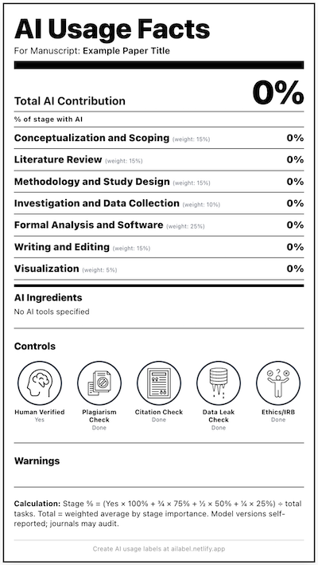

# Additional Resources & Acknowledgements

## Generative AI Disclosure Tool

We strongly encourage you to use the [**AI Usage Label**](https://ailabel.netlify.app/){:target="_blank"} tool which is free to use and was developed by [Dr. Faraz Forghan Parast](https://etcl.uvic.ca/2023/11/16/meet-the-etcl-team-faraz-forghan-parast/){:target="_blank"} who is a Fellow at the University of Victoria, [Electronic Textual Cultures Lab](https://etcl.uvic.ca/2023/11/16/meet-the-etcl-team-faraz-forghan-parast/){:target="_blank"} (ETCL). It will help you to disclose how much and how you used AI in your research work, and using it can also help you reflect on the different ways you may or may not be using AI tools in your research process.

## NotebookLM – Official Help & Guides

These links focus specifically on NotebookLM:

- [NotebookLM homepage](https://notebooklm.google/){:target="_blank"}  
- [NotebookLM Help Center](https://support.google.com/notebooklm){:target="_blank"}  
- [Google NotebookLM announcement and feature overview](https://blog.google/technology/ai/notebooklm/){:target="_blank"}  

Use these to check current features, limitations, and updates.

---

## Tutorials & How-To Videos

These videos and guides show NotebookLM and related GenAI tools in action:

- [Basic Google NotebookLM tutorial for educators](https://www.youtube.com/watch?v=w5ZcWmAltgQ){:target="_blank"} (12 min)  
- [Google is developing a new AI tool that is perfect for students](https://www.youtube.com/watch?v=ACIh44E5AoU){:target="_blank"} (6 min)  
- [Intro to Generative AI for research & writing (general overview)](https://www.youtube.com/results?search_query=generative+ai+for+research){:target="_blank"}  

Feel free to explore other tutorials that match your discipline or use case.

---

## Ethics, Academic Integrity, and Critical Use

For deeper discussion of responsible AI use in research and teaching:

- [UVic Guidelines for using generative AI in research](https://www.uvic.ca/research/teachers-staff/research-admin/research-policies/ai-guidelines/index.php){:target="_blank"}  
- [Tri-Agency guidance on use of AI in research development and review](https://www.sshrc-crsh.gc.ca/en/research-funding/policies/guidelines-research-data-management/tri-agency-guidance-use-artificial-intelligence-review-development-and-review-research-grant-proposals){:target="_blank"}  

Key principles emphasized in this workshop:

- Always **verify AI-generated content** using citations and original sources  
- Be transparent with students, colleagues, and supervisors about how you use AI  
- Never upload sensitive or confidential data into external AI systems  

---

## Acknowledgements

- [UBC Library Research Commons](https://github.com/ubc-library-rc){:target="_blank"} for their assistance with the Jekyll template for GitHub Pages.  
- UVic Libraries Digital Scholarship Commons team for workshop design, testing, and facilitation.

[NEXT STEP: Workshop Evaluation Survey](workshop-survey.html){: .btn .btn-blue }
