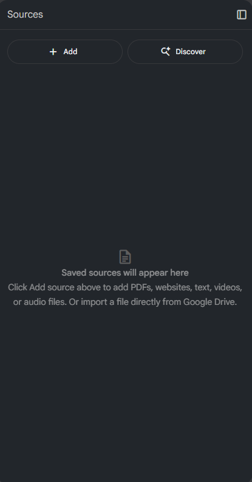
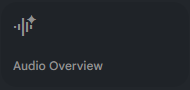
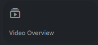
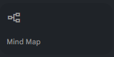
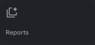
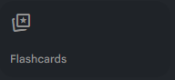

# GenAI: NotebookLM a Personal RAG Tool for Research & Productivity (_Intermediate_)

- Pre-workshop activities: 10 min 
- Introductory presentation: 15 min
- Active learning time: 60 min

## About the workshop 
- This workshop focuses on using NoteBookLM, a personal Generative AI (GenAI) tool, that becomes an expert on the specific documents you provide.
- Crucially, NoteBookLM's functionality is directly dependent on the documents you upload. It uses these documents as its training data.
- Participants will engage in hands-on activities to explore GenAI tool usage and learn how to evaluate output for accuracy and potential biases, based on the uploaded documents.
- The workshop will also promote informed and responsible use of cloud-based GenAI.

## Learning objectives

At the end of this workshop, you will be able to:

1. Describe the core capabilities of NotebookLM (text generation, summarization, translation, Q&A).
2. Use the **Notebook guide** to quickly create briefing docs and a two-host audio summary.
3. Create lecture/meeting transcription summaries tailored to audience and purpose.
4. Produce research summaries with citations; verify facts/claims against sources.
5. Generate presentation assistance (script + slide titles for Google Slides/PowerPoint).
6. Perform ideation/brainstorming: identify gaps and form research questions.
7. Summarize short-answer survey feedback to surface key issues.
8. Apply responsible-use checks (bias/hallucination mitigation with grounded prompts).
9. Share artifacts (export, screenshots) for portfolios or class submissions.

---
## 🔄 NotebookLM 2025 Feature Update

**NotebookLM** has evolved into a powerful AI-driven research and note-taking assistant that helps you summarize, visualize, and learn from your own uploaded materials.  
As of **October 2025**, NotebookLM now includes major upgrades across visual tools, AI responses, and collaboration features.

### Core Features
- **AI-grounded responses** – NotebookLM now generates answers strictly based on your provided sources, with inline citations for easy verification.  
- **Expanded input formats** – Upload PDFs, Google Docs, Word files, text, website links, or even transcribe YouTube videos directly.
- **Studio Panel** – A new workspace for generating and organizing custom outputs like reports, study guides, and blog drafts.

### Learning & Output Tools
- **Flashcards and Quizzes** – Automatically generate study aids from your uploaded materials, with adjustable topic and difficulty levels.  
- **Mind Maps** – Create interactive diagrams to explore conceptual relationships across your sources.  
- **Reports** – Updated report generator suggests content structures dynamically based on your notes.

###  Audio and Video Overviews
- **Audio Overviews** – Turn documents into AI-hosted discussions with multiple styles (Brief, Critique, Debate).  
- **Interactive Mode (Beta)** – Speak to the AI hosts to ask follow-up questions live.  
- **Video Overviews** – Generate narrated video summaries with visuals from Google’s *Nano Banana* image model (watercolor, whiteboard, or anime styles).

### Collaboration and Premium Options
- **Public Notebooks** – Share your notebooks via links; others can view and interact without editing your originals.  
- **Team Collaboration** – Invite colleagues with customizable access levels.  
- **NotebookLM Plus** – Premium plan offering enhanced audio/video limits, analytics, and team dashboards.  
- **Enterprise Tier** – Adds Microsoft Office integration, advanced permissions, and corporate security options.

### Learning Tools & Partnerships
- **Featured Notebooks** – Access curated examples from *The Economist* and *The Atlantic.*  
- **Discovery Tool** – Search and add related references directly within NotebookLM.  
- **Academic Integration** – New collaboration with *OpenStax* provides interactive textbooks and peer-reviewed materials.

---

## 📊 2024 vs 2025 NotebookLM Comparison

| Capability | 2024 Version | 2025 Version |
|-------------|--------------|--------------|
| **Studio Outputs** | One Audio & Video Overview per notebook | Multiple outputs per type; tile-based UI |
| **Visual Styles** | Basic color themes | 6 Nano Banana styles (Watercolor, Papercraft, Anime, Whiteboard, Retro Print, Heritage) |
| **Languages** | English only | Rolling out to ~80 languages |
| **AI Model** | Gemini 1.5 Pro | Gemini 2.5 Flash (long-context, faster) |
| **Sharing** | Export files only | Domain-restricted share links for Audio/Video Overviews |
| **Learning Tools** | Text summaries and reports | Mind Maps, Quizzes, Flashcards auto-generated |
| **Interface** | Linear workflow | Multitasking and real-time cross-pane updates |

> The 2025 release redefines NotebookLM as an **interactive learning studio**, not just a summarizer.

---
[NEXT STEP: Pre-Workshop Activities](pre-workshop.html){: .btn .btn-blue }

---

## 🧭 NotebookLM Interface Overview (2025)

### 🗂️ Sources Panel
Upload and organize documents (PDFs, links, docs, transcripts).  

---

### 💬 Chat Panel
Ask questions, summarize, and generate content grounded in your sources.  

---

### 🏗️ Studio Workspace
Create outputs such as Audio/Video Overviews, Mind Maps, Reports, Quizzes, and Flashcards.  

#### Studio tools at a glance

| Tool | What it does | Visual |
|---|---|---|
| **Audio Overview** | AI hosts narrate and connect ideas from your sources. |  |
| **Video Overview** | Generates narrated explainers with visuals (Brief or Explainer). |  |
| **Mind Map** | Auto-diagrams key topics and relationships. |  |
| **Reports** | Briefings and study guides with inline citations. |  |
| **Quiz** | Creates comprehension checks from your notes. |  |
| **Flashcards** | Builds spaced-repetition cards for memory reinforcement. |  |

> Tip: Studio now supports **multiple outputs of the same type** (e.g., several Audio or Video Overviews for different chapters/audiences/languages).  
> You can also **multitask**—listen to audio while exploring a Mind Map or editing notes.

## Generative AI Workshop Pathway

This workshop is part of our Generative AI Workshop Pathway. The Pathway workshops are designed to help subject area experts and non-experts, and help meet the needs of students, faculty, & staff by offering foundational to advanced research & productivity skills training:

- **[GenAI Introductory Workshops](https://uviclibraries.github.io/genai-pathway/#introductory-workshops){:target="_blank"}**
- **[GenAI Intermediate Workshops](https://uviclibraries.github.io/genai-pathway/#intermediate-workshops){:target="_blank"}**
- **[GenAI Advanced Workshops](https://uviclibraries.github.io/genai-pathway/#intermediate-workshops){:target="_blank"}**

---

