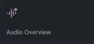
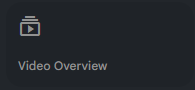
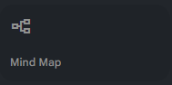
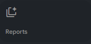
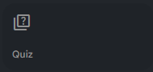
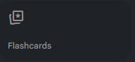

# Workshop Activities

---

## Workshop Roadmap

| Activity | Focus                                      | Time  | NotebookLM Features                        |
|---------|--------------------------------------------|-------|--------------------------------------------|
| 1       | Build your first notebook                  | 20–25 | Sources, source summaries, basic chat      |
| 2       | Summarizing text, audio, and video         | 20–25 | Source summaries, citations, Audio/Video   |
| 3       | Brainstorming & research question ideas    | 20–25 | Chat, idea generation, Notebook Guide      |
| 4       | Summarizing survey / qualitative feedback  | 15–20 | Reports, themes, tables, citation checking |
| 5       | Turning an article into a presentation     | 20–25 | Reports, outlines, slides, speaker notes   |

Use this page as a “menu” during the workshop. Each activity has its own detailed instructions linked from the left-hand navigation.

---

## 🔍 Activity Preview Gallery

| Studio Tool     | Preview Image                                      |
|-----------------|----------------------------------------------------|
| Audio Overview  |        |
| Video Overview  |        |
| Mind Map        |            |
| Reports         |                      |
| Quiz            |                            |
| Flashcards      |                |
| Infographic     |                |
| Slide Deck      |                |
> Tip: Studio supports **multiple outputs of the same type** (e.g., several Audio or Video Overviews for different chapters/audiences/languages). You can also **multitask**—listen to an Audio Overview while exploring a Mind Map.

---
### Prompts to Try in NotebookLM

| Goal | Example Prompt |
|------|----------------|
| Simplify | “Rewrite this passage in simple modern English.” |
| Analyze | “List all metaphors and explain their literal meaning.” |
| Visualize | “Create a mind map of the imagery and emotions.” |
| Summarize | “Explain the tone and message of this passage in 3 sentences.” |
| Create | “Turn this excerpt into a 2-minute podcast script between two AI hosts.” |
| Test | “Generate five quiz questions about themes and imagery.” |

> 💡 Tip: Have the whole group use the *same* passage and prompt set first; compare how phrasing changes the outputs. Then iterate with new prompts.

---

## 🔬 Feature Exploration Activities (1–6)

### 🧩 Activity 1: Studio Panel Exploration
**Goal:** Learn to generate and organize outputs in Studio.  
**Steps:**
1. Upload 2–3 documents (PDFs, web links, or transcripts).
2. Open **Studio** and create:
   - One **Report** (summary/briefing)
   - One **Blog Post** (creative/reader-friendly)
3. Compare structure, tone, and citation behavior.
4. Reflect: How does the requested format affect style and depth?

---

### 🧠 Activity 2: Mind Map Creation
**Goal:** Visualize relationships between key concepts.  
**Steps:**
1. Upload a research paper or lecture notes.
2. Generate a **Mind Map** from your sources.
3. Add at least **3 manual nodes** for missing links or next questions.
4. Screenshot and save (e.g., `mindmap-activity.png`) for your portfolio.

---

### 🔊 Activity 3: Audio Overview Challenge
**Goal:** Experience conversational, source-grounded summaries.  
**Steps:**
1. With 2–3 sources loaded, open **Audio Overview** and pick **Brief**.
2. Listen for 2–3 minutes; note claims and citations mentioned.
3. Switch to **Critique** mode; list differences in tone and depth.
4. Record 2 follow-up prompts that improved clarity.

---

### 🎥 Activity 4: Video Explainer Generation
**Goal:** Turn notes into a short visual explainer.  
**Steps:**
1. Open **Video Overview**.
2. Generate both **Explainer** and **Brief** versions from the same sources.
3. Change style (e.g., **Whiteboard** vs **Watercolor**) and compare.
4. Decide which format/style best fits your audience and why.

---

### Studio: Slide Decks & Infographics

Use these optional activities if you want to push beyond text and audio:

- ** 📊 Slide Deck Draft**  
  - Pick any notebook you’ve created (e.g., the badge articles or your own course/project docs).  
  - Ask NotebookLM to generate a **slide outline** or full draft deck for a 5–10 minute talk.  
  - Copy the outline into Google Slides or PowerPoint and edit:
    - Keep the helpful structure (section order, key points).  
    - Rewrite vague or generic bullets.  
    - Remove any slide that doesn’t serve a clear purpose.

- ** 🧩 Infographic Summary**  
  - Ask NotebookLM to create a **one-page infographic specification**: title, sections, 3–5 key points, and suggested icons/visuals.  
  - Use that specification to design a simple infographic in your preferred tool (Canva, PowerPoint, Google Slides, etc.).  
  - Optionally, compare two versions: one for **experts** (more detail) and one for **non-specialists** (fewer, clearer points).

> **Pro tip:**  
> When you generate slide decks or infographics, always specify **audience**, **time limit**, and **medium** in your prompt (e.g., “10-minute talk for non-experts using 5–7 slides”). The more specific the context, the more usable the AI-generated structure will be.

---

### 👥 Activity 5: Team Collaboration Sprint
**Goal:** Practice sharing and role-based review.  
**Steps:**
1. Share a notebook with one peer (viewer/commenter).
2. Peer generates an **Audio** or **Video Overview**.
3. Compare their AI interpretation with your expectations.
4. Note 2 action items to improve prompts or sources.

---

### 🧭 Activity 6: Discovery Mode
**Goal:** Enrich a notebook with relevant external sources.  
**Steps:**
1. Open **Discovery** inside NotebookLM.
2. Add **two** web sources that complement your uploads.
3. Re-run your **Report** and note what changed.
4. Mark any unsupported claims for verification.

---

## ✍️ Creative Writing & Research Analysis (7–12)

### 🗂️ Activity 7: Studio Variants (Roles & Languages)
**Goal:** Use multiple outputs of the same type in a single notebook.  
**Steps:**
1. Create **three** Audio Overviews from the same sources:
   - Beginner overview (English)
   - Manager overview (decision-focused)
   - Second-language overview (your choice)
2. Compare tone, coverage, and examples; refine prompts accordingly.

---

### 🧾 Activity 8: Report Synthesis (3+ Sources)
**Goal:** Produce a coherent briefing from multiple documents.  
**Steps:**
1. Upload **≥3** related sources (paper, article, slide deck).
2. Use **Report**; set a target audience and purpose.
3. Edit headings; add 2 grounded citations per section.
4. Export or screenshot for your portfolio.

---

### 🧠 Activity 9: Bias & Perspective Check
**Goal:** Audit tone and balance across viewpoints.  
**Steps:**
1. Upload **two** opinion pieces with opposing views.
2. Summarize each; highlight subjective language.
3. Ask for a **neutral synthesis** with explicit citations.
4. List 3 questions you’d ask an expert to validate the result.

---

### 📊 Activity 10: Visual Thinking (Mind Map → Questions)
**Goal:** Turn structure into inquiry.  
**Steps:**
1. Generate a **Mind Map**.
2. From the map, distill **5 research questions**.
3. For each question, request **two** cited answers from Chat.
4. Track which questions need more/better sources.

---

### 💬 Activity 11: Peer Feedback Loop
**Goal:** Improve through outside review.  
**Steps:**
1. Share a public-view notebook link.
2. Ask a peer to review your **Report** and **Video Overview**.
3. Collect 3 concrete improvement notes (scope, clarity, citations).
4. Iterate once and note what changed.

---

### ⭐ Activity 12: Design Your Own Use-Case
**Goal:** Build a reusable workflow.  
**Steps:**
1. Pick a scenario (e.g., classroom recap, grant brief, policy explainer).
2. Document the exact steps: sources → Studio tool(s) → outputs.
3. Save a template prompt and a sample result.
4. Submit your use-case to the class/team library.

---

## 📝 Reflection & Submission

**Reflect (5–7 sentences):**  
What did NotebookLM do best for your task? Where did grounding/citations help? What would you change about your sources or prompts next time?

**Submit:**  
- One screenshot of **Mind Map**  
- One **Report** (PDF/export or screenshot)  
- Either an **Audio** or **Video Overview** link (domain-permitted)  
- Your reflection paragraph

**Rubric (quick):** completeness (40%), source-grounding & citations (30%), clarity & audience fit (20%), polish (10%).
